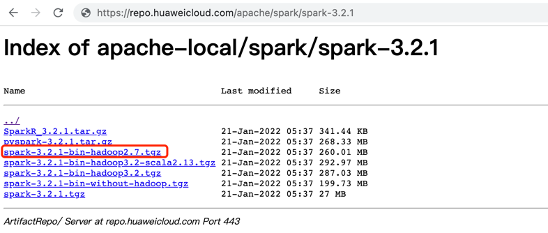
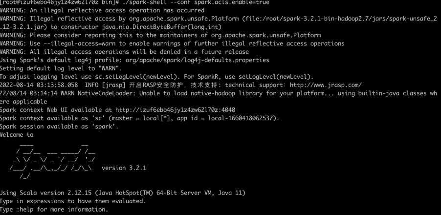
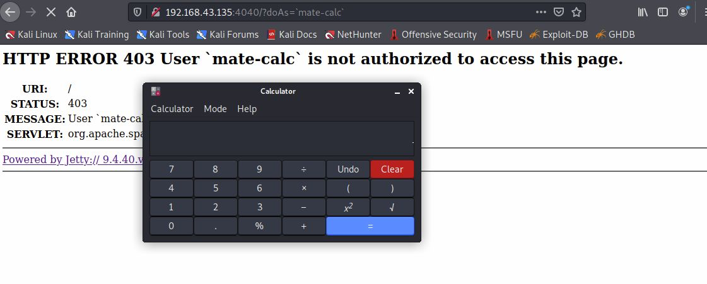
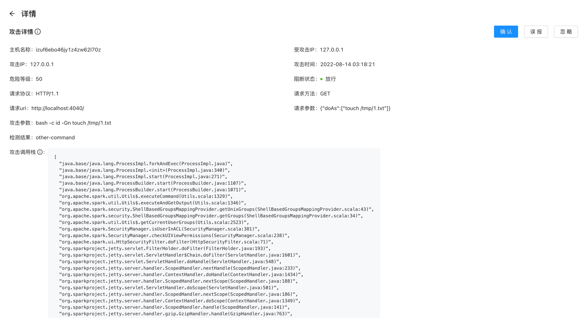
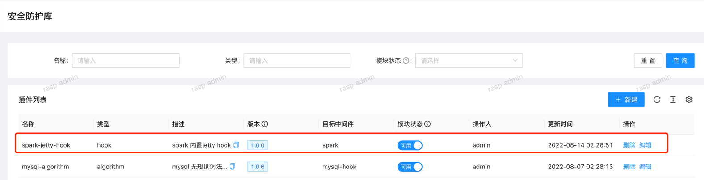

# CVE-2022-33891

## 漏洞简介
Apache发布安全公告，修复了一个Apache Spark中存在的命令注入漏洞。
漏洞编号：CVE-2022-33891，漏洞威胁等级：高危。Apache Spark UI提供了通过配置选项Spark.acl.enable启用acl的可能性。
使用身份验证过滤器，这将检查用户是否具有查看或修改应用程序的访问权限。
如果启用了acl，HttpSecurityFilter中的代码路径可以允许某人通过提供任意用户名来执行模拟。
恶意用户可能能够访问权限检查功能，该功能最终将根据他们的输入构建一个 Unix shell 命令并执行它。
这将导致任意 shell 命令执行。

## 影响版本

Spark Core - Apache <=3.0.3

3.1.1 <= Spark Core - Apache <=3.1.2

3.2.0 <= Spark Core - Apache <=3.2.1


## 环境搭建

下载 [Apache Spark 3.2.1](https://repo.huaweicloud.com/apache/spark/spark-3.2.1/spark-3.2.1-bin-hadoop2.7.tgz)



漏洞触发的关键在于是否启用ACL，使用身份验证过滤器。

启用ACL的两种方式：
1、通过设置选项 spark.acls.enable 启用 。
2、运行spark-shell时，通过-c（--conf）参数启动。

启动
```java
./spark-shell --conf spark.acls.enable=true
```




## 漏洞触发




## RASP 检测



## 说明

需要说明的是, spark-ui内置jetty处理http请求，并且使用 shade 打包方式修改了 jetty 包的前缀。

rasp hook的jetty类全限定名称：org.<font color='red'>eclipse</font>.jetty.server.Server，而 spark中该类的名称：org.<font color='red'>sparkproject</font>.jetty.server.Server

对于这种场景，http参数必然丢失。
为了解决上面的问题，传统rasp需要修改代码，即：增加hook类，打包编译agent，重新发布，推动业务进程重启的流程； 而jrasp仅需要新增hook模块，无需重启业务，下发立即生效。




