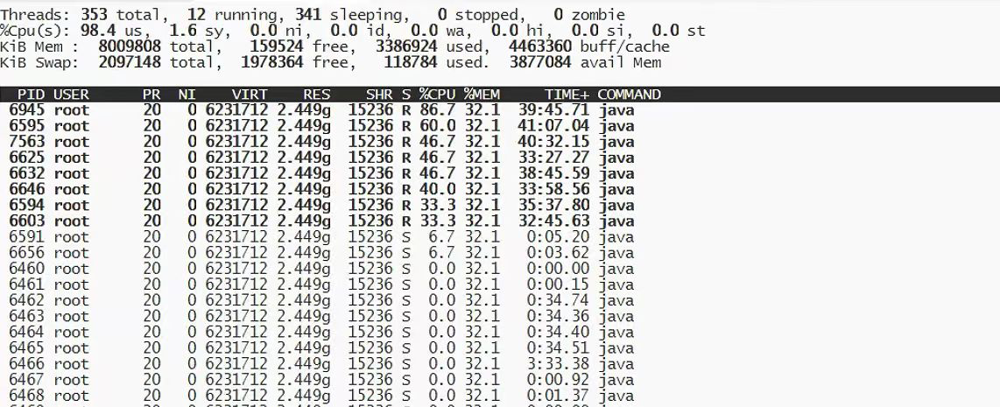
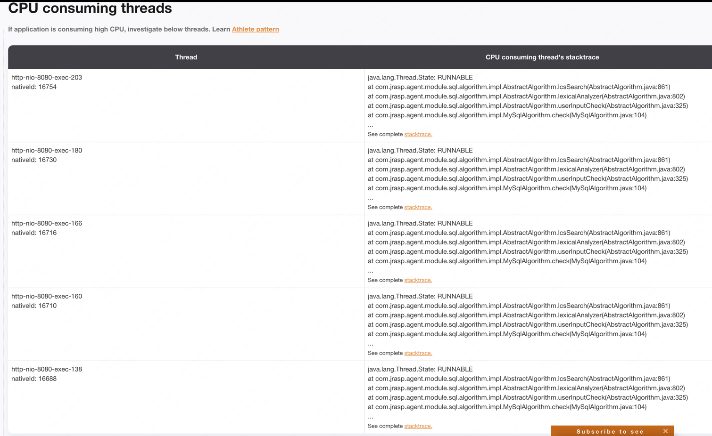
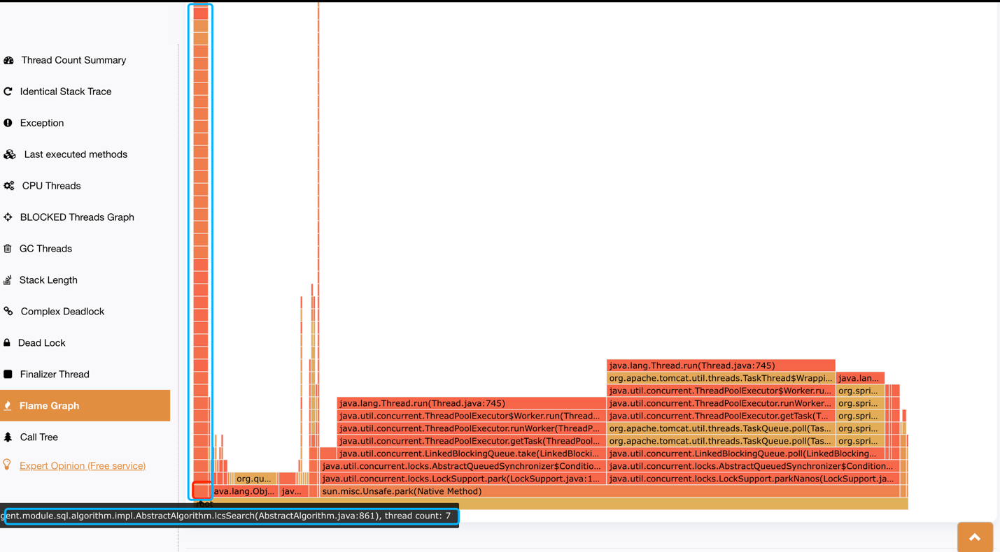
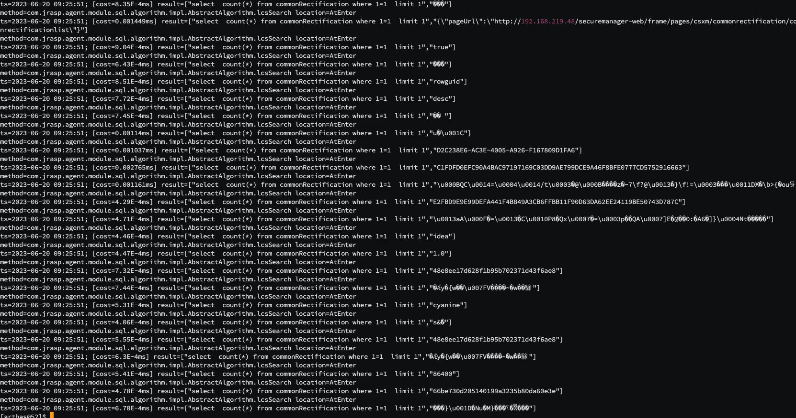
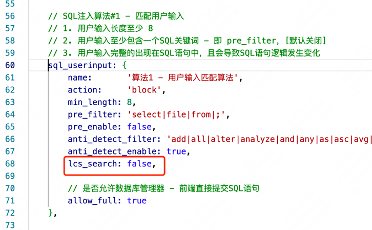
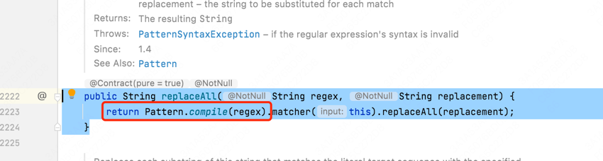
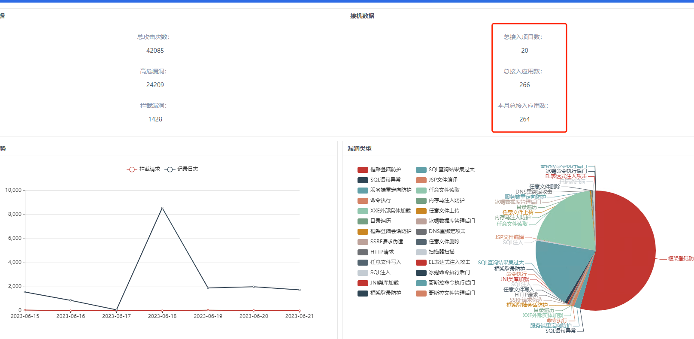

# sql注入检测算法cpu飙高排查以及优化

## 问题
 
jrasp sql 注入检测模块运行之后cpu飙高，使用 top -Hp {pid} 查看线程cpu使用情况如下：



可以看到有8个线程的cpu使用率明显高于其他线程，并且业务反馈无法处理sql。


## dump 线程栈

用线程分析工具查看cpu高的线程的调用栈

使用[性能分析网站](https://fastthread.io)

查看：[诊断结果](https://fastthread.io/my-thread-report.jsp?p=c2hhcmVkLzIwMjMvMDYvMTkvMjAyMy0wNi0xOS0xNS01MS0xMVvnur_nqIvlv6vnhaddLnN0YWNrLS04LTU2LTUy&)

线程占用top5：




对应的火焰图：



从火焰图上可以看到方法占用的耗时较多：
com.jrasp.agent.module.sql.algorithm.impl.AbstractAlgorithm.lcsSearch(AbstractAlgorithm.java:861)

## 分析方法的调用



业务采用公共子序列的算法，把所有参数都遍历了一次，可以看到一次sql执行匹配几十次之多，性能非常糟糕。

## 第一次性能优化

jrasp 实现的 lcsSearch 算法存在性能问题，线上环境不可以开启。

然而最早采用这个算法的是开源项目open-rasp （记忆中有这个算法）

然后实际去看了为什么他没有这个性能问题，看到的结果如下，`lcs_search`默认是关闭的！！！！ 嗯嗯，是这样的，没有解释为什么（应该也是遇到坑了）



优化的结论：去掉这个不能用的算法，只使用字符串匹配。
      

## 第二次性能优化 

在第一版本的优化上线之后，但是过了几个小时cpu又慢慢升高了！！

再次查看线程栈，cpu占用高的线程栈如下：
```java
"http-nio-8080-exec-80" #2179 daemon prio=5 os_prio=0 tid=0x00007fa2f0065800 nid=0x156f runnable [0x00007fa2dd732000]java.lang.Thread.State: RUNNABLE
 at java.util.regex.Pattern.sequence(Pattern.java:2063)
 at java.util.regex.Pattern.expr(Pattern.java:1996)
 at java.util.regex.Pattern.compile(Pattern.java:1696)
 at java.util.regex.Pattern.<init>(Pattern.java:1351)
 at java.util.regex.Pattern.compile(Pattern.java:1028)
 at java.lang.String.replaceAll(String.java:2223)
 at com.jrasp.agent.module.sql.algorithm.impl.AbstractAlgorithm.lexicalAnalyzer(AbstractAlgorithm.java:795)
 at com.jrasp.agent.module.sql.algorithm.impl.AbstractAlgorithm.userInputCheck(AbstractAlgorithm.java:325)
 at ... 
```

这次cpu飙高的是`String.replaceAll`,replaceAll中调用 `Pattern.compile` 编译导致cpu高

看了以下`String.replaceAll`实现原理



居然每次都调用 Pattern.compile，并没有使用缓存！！于是改成缓存Pattern.compile编译结果，cpu恢复正常。

相关原理可以看[Java中String对象的replaceAll方法调用性能优化小技巧](https://blog.csdn.net/hadues/article/details/128002667).

至此解决sql注入检测的cpu性能问题

## 灰度情况
优化之后，目前已经安装 200+ 应用，稳定运行。


当前安装的仅为业务机器的冰山一角，还有几十万机器等待安装。