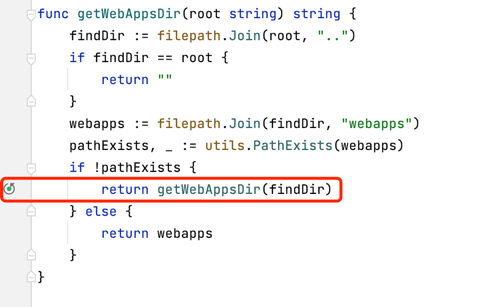

# daemon进程cpu飙高排查以及优化

## 问题描述

jrasp在某个业务线批量部署几百台，运行一段时间业务反馈jrasp-daemon进程的cpu占用高，大量服务器cpu告警，查看系统cpu占用的进程如下：
```shell
PID   USER   PR  NI     VIRT      RES    SHR   S   %CPU  %MEM     TIME+        COMMAND 
5373  root   20  0   1446588   199152   7300   R  232.7   1.2    8:39.63  jrasp-daemon 
5101  root   20  0   1446076   194212   7372   R  215.0   1.2    8:31.81  jrasp-daemon 
1720  root   20  0   1512720   309572   7908   S  191.3   1.9  122:19.27  jrasp-daemon 
5218  root   20  0   1312276    74048   7336   R  133.3   0.5    5:51.19  jrasp-daemon 
 864  root   20  0    772084    39732  20220   S    7.7   0.2    2:04.97  filebeat 
1352  root   20  0   1002160    77888  26628   S    1.0   0.5    0:28.61  dockerd 
1678  root   20  0   1209620    41144  16892   S    1.0   0.3    0:32.43  containerd 
 580  root   20  0     47660    13644   13248  S    0.7   0.1    1:15.97  systemd-journal 
2729  root   20  0   1388976    94168  45108   S    0.7   0.6    0:40.26  filebeat 
3750  root   20  0   1538268    81152   6112   S    0.7   0.5    0:28.51  icsfilesec 
5129  root   20  0     10.0g     2.3g  15856   S    0.7  14.7    2:39.70  java 
   1  root   20  0    191392     4356   2604   S    0.3   0.0    0:09.70  systemd 
 810  root   16 -4     55532     1076    628   S    0.3   0.0    0:09.01  auditd 
3626  root   20  0    110216     4964   3336   S    0.3   0.0    0:03.12  containerd-shim 
4202  root   20  0     25940     1844   1248   S    0.3   0.0    0:02.09  wrapper 
4284  root   20  0   7936208     1.3g  15548   S    0.3   8.7    2:32.22  java 
4740  root   20  0   7925632     1.3g  15316   S    0.3   8.4    2:07.96  java 
5062  root   20  0     25940     1848   1252   S    0.3   0.0    0:02.00  wrapper 
6805  root   20  0   6794680   394716  16800   S    0.3   2.4    0:53.78  java 
15799 eproot 20  0    162232     2408   1580   R    0.3   0.0    0:00.13  top 
```
可以看到cpu占用的前几个进程都是是jrasp-daemon，并且cpu数值较高。

jrasp 1.1.1版本在该业务已经部署了几千台，并且运行了足够长时间，没有出现cpu的问题，初步怀疑是该业务线的特殊场景引发性能问题。

Go程序像C/C++一样，如果开发编码考虑不当，会出现cpu负载过高的性能问题。如果程序是线上环境或者特定场景下出现负载过高，
问题不好复现，则需要利用当前负载过高的进程进行调用栈分析。
C/C++中一般先通过top -d 1 -p $pid -H 命令查看负载过高的线程号(TID)，
然后使用gdb attach到该进程，通过thread info获取线程信息，然后切换到对应负载高的线程，输入bt查看调用栈。
结合对应代码中的函数，进一步分析。Go语言中方法也类似，我们将通过`dlv`来分析负载高的协程调用栈。

## 排查过程

> 实际性能分析由业务方自行完成，jrasp团队仅负责协助分析


### 通过top查看高cpu的线程tid
通过上一步，我们确定了是pid=5373的jrasp-daemon进程cpu过高，那么可以通过`top -d 1 -p 5373 -H` 来确认cpu过载的线程tid，如下所示：
```
$ top -d 1 -p 5373 -H
PID  USER PR NI     VIRT    RES  SHR S  %CPU  %MEM     TIME     +COMMAND 
2722 root 20 0   1511696 250840 7776 R  51.0   1.5   14:43.26 jrasp-daemon 
2734 root 20 0   1511696 250840 7776 R  29.0   1.5   12:12.83 jrasp-daemon 
2742 root 20 0   1511696 250840 7776 S  29.0   1.5   15:12.88 jrasp-daemon 
2725 root 20 0   1511696 250840 7776 S  22.0   1.5   14:43.70 jrasp-daemon 
2723 root 20 0   1511696 250840 7776 S  0.0    1.5    0:07.07 jrasp-daemon 
2724 root 20 0   1511696 250840 7776 S  0.0    1.5    0:00.00 jrasp-daemon 
2726 root 20 0   1511696 250840 7776 S  0.0    1.5    0:00.00 jrasp-daemon 
2731 root 20 0   1511696 250840 7776 S  0.0    1.5    0:00.00 jrasp-daemon 
2732 root 20 0   1511696 250840 7776 S  0.0    1.5    0:00.02 jrasp-daemon 
2733 root 20 0   1511696 250840 7776 S  0.0    1.5   14:25.01 jrasp-daemon 
2741 root 20 0   1511696 250840 7776 S  0.0    1.5   14:54.15 jrasp-daemon 
```
通过以上操作，可以确认tid=2722,2734,2742和2725四个线程的cpu过高。

### 通过dlv附加到进程，分析线程/协程cpu过载的堆栈

首先，如果生产环境没有dlv，则可以拷贝对应的dlv到/usr/local/bin下。
接着执行`dlv attach 5373`，确认thread id为2722,2734,2742和2725的协程ID
```text
$ dlv attach 5373
...
Goroutine 12 User:/Users/2023/Work/Git/Epoint/EpointRASP/jrasp-daemon/watch/watch.go:76 jrasp-daemon/watch.(*Watch).Do ttach (0xe6elec)[select 6001235539985] 
Goroutine 13 User:/Users/2023/Work/Git/Epoint/EpointRASP/jrasp-daemon/watch/watch.go:95 jrasp-daemon/watch.(*Watch).Ja astatusTimer (Oxe6e576)[select 11136962984742]
Goroutine 14 User:/Users/2023/Work/Git/Epoint/EpointRASP/jrasp-daemon/watch/docker notify.go:29 jrasp-daemon/watch.(*W tch).ContainerTimer (Oxe66f3d)[select 11208000116197] 
Goroutine 15 User:/usr/local/go/src/runtime/time.go:195 time.Sleep (0x472090)[sleep 11206694041347]
Goroutine 17 User:/usr/local/go/src/runtime/sigqueue.go:152 os/signal.signal_recv (0x471ac9)(thread 2724)              
Goroutine 18 User:/usr/local/go/src/runtime/proc.go:399 runtime.gopark (0x443e5c)[debug call] 
Goroutine 19 User:/usr/local/go/src/runtime/proc.qo:399 runtime.gopark (0x443e5c)[debug call]
Goroutine 20 User:/usr/local/go/src/path/filepath/path.go:44 path/filepath.(*lazybuf).append (0x572e18)(thread 2725)    
Gorouttne 33-User:/usr/tocal/go/src/runttme/proc.go:399 runttme.gopark (0x443e5c)[debug call 11177894059277]
Goroutine 34 User:/usr/local/go/src/runtime/proc go:399 runtime gopark (0x443e5c)[debug call]
Goroutine 35 User:/usr/local/go/src/path/filepath/path.go:122 path/filepath.Clean (0x573510)(thread 2734)               
Goroutine 37 -User:/usr/local/go/src/net/fd posix.go:55 net.(*netFD).Read (0x74cc73)[I0 wait 11208000116197] 
Goroutine 38 User:/usr/local/go/src/net/http/transport.go:2421 net/http.(*persistConn).writeLoop (0x93a747)[select 208000116197]
Goroutine 38 User:/usr/local/go/src/net/http/transport.go:2421 net/http.(*persistConn).writeLoop (0x93a747)[select 208000116197] 
Goroutine 49 User:/usr/local/go/src/os/file_posix.go:29 os.(*File).read (0x548c38)[I0 wait] 
Goroutine 50 User:/usr/local/go/src/os/file_posix.go:29 os.(*File).read (0x548c38)[I0 wait 6001235539985] 
Goroutine 51 User:/Users/2023/Work/Git/Epoint/EpointRASP/jrasp-daemon/watch/java_notify.go:46 jrasp-daemon/watch.(*Wat h).NotifyJavaProcess.func3 (0xe6cf52)[select 6001235539985] 
Goroutine 52 User:/Users/2023/Work/Git/Epoint/EpointRASP/jrasp-daemon/watch/java notify.go:98 jrasp-daemon/watch.(*Wat h).NotifyJavaProcess.func4 (0xe6caa6)[select 6001235539985] 
```

### 在dlv中切换到对应高cpu协程，并查看堆栈

```text
0 0x0000000000573510 in path/filepath.Clean
  at /usr/local/go/src/path/filepath/path.go:122
1 0x0000000000576c71 in path/filepath.join
  at /usr/local/go/src/path/filepath/path unix.go:49
2 0x0000000000574077 in path/filepath.Join
  at /usr/local/go/src/path/filepath/path.go:270
3 0x0000000000e57145 in jrasp-daemon/java process.getWebAppsDir
  at /Users/2023/Work/Git/Epoint/EpointRASP/jrasp-daemon/java process/process.go:450
4 0x0000000000e5729e in jrasp-daemon/java process.getWebAppsDir
  at /Users/2023/Work/Git/Epoint/EpointRASP/jrasp-daemon/java_process/process.go:457
5 0x0000000000e5729e in jrasp-daemon/java process.getWebAppsDir
  at /Users/2023/Work/Git/Epoint/EpointRASP/jrasp-daemon/java process/process.go:457
6 0x0000000000e5729e in jrasp-daemon/java_process.getWebAppsDir
  at /Users/2023/Work/Git/Epoint/EpointRASP/jrasp-daemon/java process/process.go:457
7 0x0000000000e5729e in jrasp-daemon/java process.getWebAppsDir
  at /Users/2023/Work/Git/Epoint/EpointRASP/jrasp-daemon/java process/process.go:457
8 0x0000000000e5729e in jrasp-daemon/java process.getWebAppsDir
  at /Users/2023/Work/Git/Epoint/EpointRASP/jrasp-daemon/java process/process.go:457
9 0x0000000000e5729e in jrasp-daemon/java process.getWebAppsDir
  at /Users/2023/Work/Git/Epoint/EpointRASP/jrasp-daemon/java process/process.go:457
10 0x0000000000e5729e in jrasp-daemon/java_process.getWebAppsDir
  at /Users/2023/Work/Git/Epoint/EpointRASP/jrasp-daemon/java process/process.go:457
11 0x0000000000e5729e in jrasp-daemon/java process.getWebAppsDir
  at /Users/2023/Work/Git/Epoint/EpointRASP/jrasp-daemon/java process/process.go:457
12 0x0000000000e5729e in jrasp-daemon/java process.getWebAppsDir
  at /Users/2023/Work/Git/Epoint/EpointRASP/jrasp-daemon/java_process/process.go:457
13 0x0000000000e5729e in jrasp-daemon/java_process.getWebAppsDir
More--
```

通过以上操作，可以确认业务层`java_process/process.go:457`处的`process.getWebAppsDir`方法存在性能问题。

源代码如下：



该部分代码作用是识别tomcat/webapps目录下应用名称，仅用作上报之用。是业务在开源版本上单独定制的功能。

### 原因分析与修复
上面的代码可以理解为目录"../../../../../webapps"与" ../" 的拼接，并且存在递归调用，当目录查找不到时，性能影响较大。

优化建议： 去掉递归代码，控制目录搜索层次，优化后cpu无升高现象。

## 总结
对于已经在运行中的go程序，如果遇到cpu负载高，可以通过dlv附加到该进程进行堆栈分析cpu高负载的性能问题，并进行优化。
如果该环境进程因为去除符号表等调试信息之类的原因，无法查看堆栈，我们也可以在复现问题的环境中，运行一个添加了pprof性能工具库的go程序，pprof 是一个强大的性能分析工具，可以捕捉到多维度的运行状态的数据。
