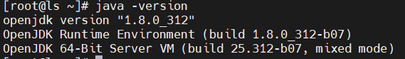
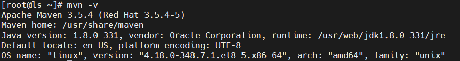
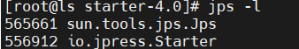
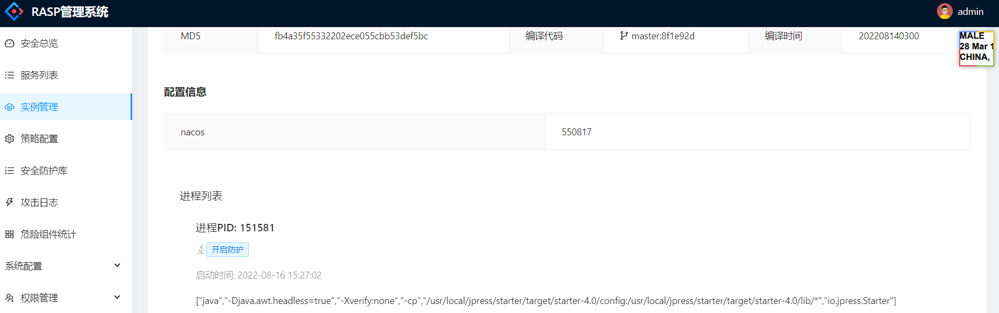
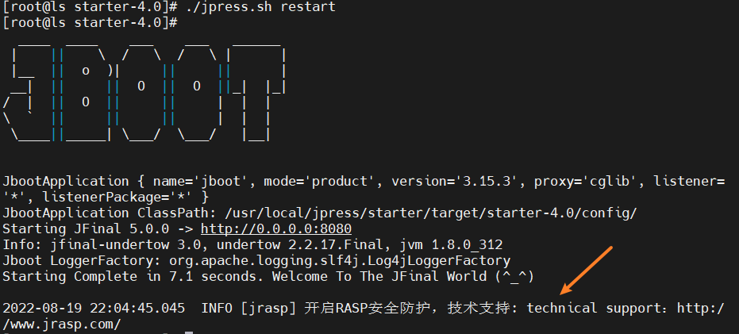

# JPress

## 背景说明

cms系统由于功能灵活且复杂，涉及三方组件众多而漏洞频发，几乎每次大规模漏洞都会中招，而不可避免的成为攻击的重点目标，以JPress为例子介绍jrasp如何防护这类产品。

> JPress，一个使用Java开发，对标WordPress的产品。天生融合微信生态系统，简单易上手。致力于为企业打造自主自属的营销平台，用技术助力企业营销变现。

## 安装环境

1. Centos 7
2. Maven 3.5.4
3. JDK 8

## 安装流程

### JPress安装

1. 安装 Java 环境

   

2. 安装 maven 编译环境

   
3. 下载jpress源码
    ```sh
    git clone https://gitee.com/JPressProjects/jpress.git
    ```
4. 编译jpress
    ```sh
    cd jpress
    mvn clean package
    ```
5. 运行jpress
    ```sh
    cd starter/target/starter-4.0
    ./jpress.sh start
    ```
6. 查看JPress进程

   

### jrasp安装
1. 安装 agent
    ```sh
    curl https://jrasp-download.oss-cn-shanghai.aliyuncs.com/jrasp-install.sh|bash
    ```

2. 安装 filebeat
    ```sh
    curl https://jrasp-download.oss-cn-shanghai.aliyuncs.com/filebeat-install.sh|bash
    ```
3. 登陆管理端 查看是否成功开启防护以及防御效果

   参考: [快速安装](docs/guide/install/simple.md)

   

4. 仅安装jrasp agent
   上面的流程需要安装管理端，也可以仅安装jrasp agent
   
    教程参考：[quick-start](../quick-start/use.md)

### 确认开启防护
1. 查看JPress启动日志, 将看到jrasp自动开启了防护
   

## 注意
1. 如果是安装再另一台电脑上，远程访问JPress失败，可以将JPress中设置的localhost:8080改为0.0.0.0:8080，再重新访问

## 附录

1. JPress 指南：[http://doc.jpress.cn/manual/start.html](http://doc.jpress.cn/manual/start.html)
2. jrasp 指南：[https://jrasp.com/guide/quick-start/use.html](https://jrasp.com/guide/quick-start/use.html)
