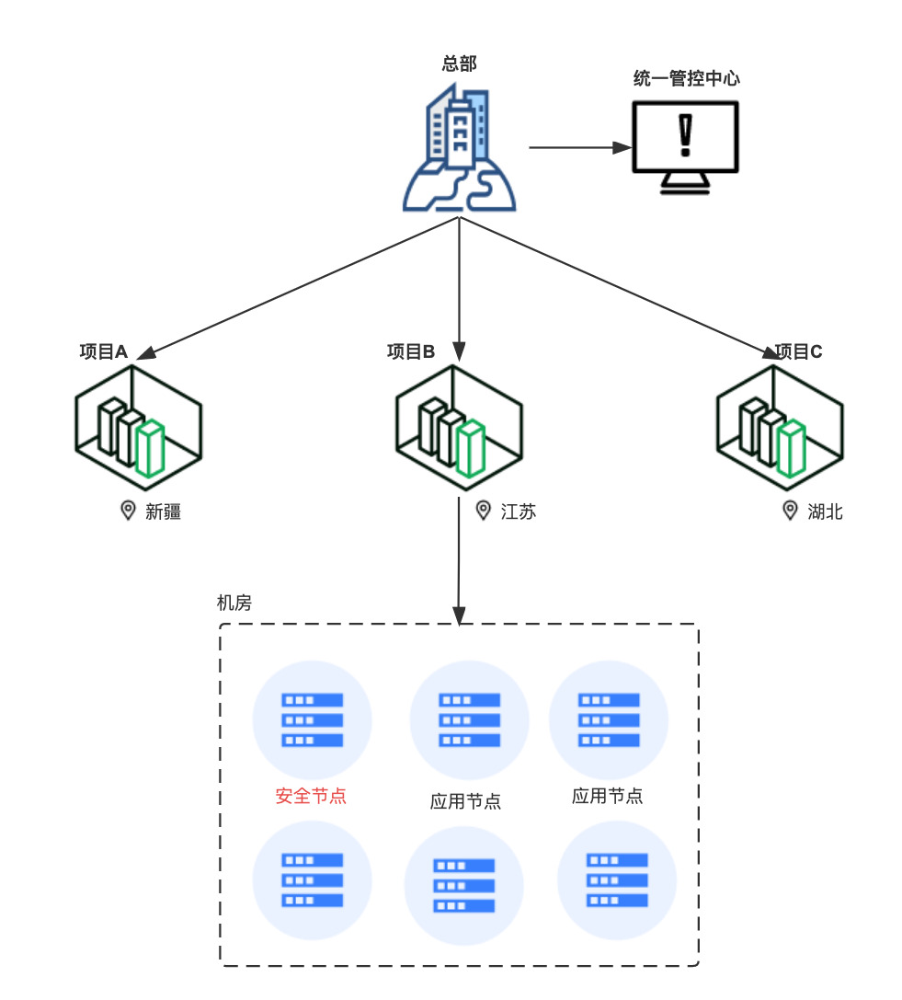

# JRASP在万级别主机大规模落地实践

## 1.背景介绍

目前开源的RASP产品中，有百度open-rasp，jrasp、字节hids-rasp等多款产品。在产品选型阶段，
因为公司内部有不少华为ARM指令架构的系统，中间曾经尝试改造V8检测引擎但最终失败，只能无奈放弃；
字节HIDS/RASP安全策略不多，偏向于"日志时收集器"，无法满足当前的生产环境的需求。

试用了一款商业RASP后，“机缘巧合”下找到了开源的jrasp。于是开始安装适用。

## 2.项目信心

尽管JRASP项目在github上star数量不多，
但是经过与作者一段时间的技术交流，发现他长期从事Java Agent开发工作，在
性能诊断、故障演练、全链路监控等方面经验非常丰富，
并且对同类产品如
arthas、btrace、jvm-sandbox、skywalking、open-rasp等有这源码级别的理解。

jrasp项目吸收了同类产品的优势，核心框架层的代码最早的可以追溯到10年前，稳定耐用bug极少。

## 3.架构与安装

### 3.1 业务特征

公司共有3000多个项目，分布在全国各地，每个项目的节点数量在20～200台，总节点数量超过10万规模。
每个项目相互隔离，要求在每个项目部署安全产品，所有的安全产品共用1台主机(RASP产品占用约0.5台)。

### 3.2 JRASP的整体架构

+ 主要包含三个部分：jrasp-agent、jrasp-daemon、jrasp-admin；

+ 安全插件模块化。每种模块解决一类安全漏洞，并且模块可以做到热升级；

### 3.3 安装部署

需要准备的资源：4核8GB配置主机一台，用做管理端。

+ 管理端编译安装文档：https://github.com/jvm-rasp/web/blob/master/README.md

+ Agent一键安装文档：https://www.jrasp.com/guide/install/v1.1.3/jrasp-agent.html

## 4.性能对比

在上线之前做了严格的性能测试，并且对多款产品性能数据，因为涉及到其他产品，细节数据不便展示，可以总结为：
`资源使用低、检测引擎性能高`。

## 5.主要的改造

RASP产品无法直接在企业内部使用，必须经过一定的改造，以适应企业的生态环境。主要的改造点有：
+ 支持 windows、macos、linux（x86_64、aarch64）；
+ 支持 docker 内运行；
+ 新增多个检测模块如内存马和SQL注入等，模块运行时解密；
+ 管理端由Java改造为Golang

除了通用的功能改造外，还对JRASP做了一些专属改造，如增加公司自研的登录框架的弱密码检测模块，流量解密模块等，
管理端增加了内部的移动设备登录功能，简化了模块与策略的配置流程等。

## 6.灰度部署

经过长达半年的灰度部署过程中，累计发现并修复数十个兼容性稳问题和bug，产品稳定性、性能逐步稳定，

## 7.性能优化

jrasp框架层面没有性能上的瓶颈，性能主要体现在检测模块上，如新增的sql词法分析算法，初始版本导致cpu飙高
参考:https://www.jrasp.com/guide/case/case20230619/case20230619.html

web应用名称的识别上，存在bug导致守护进程cpu飙升。
参考：https://www.jrasp.com/guide/case/case20230902/case20230902.html

## 8.现状与总结

截止目前，JRASP在公司内部已经安全了近万台，整体上没有上面大的问题，安全检出率达标，

不足之处： 

