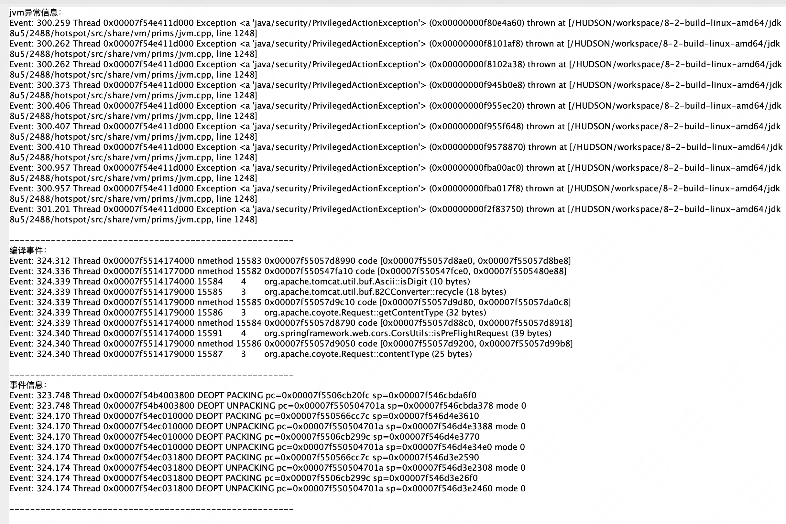

# jvm crash

## 现象

nacos服务加载 jrasp 后崩溃, 出现 `hs_err_pid32403.log`

## 诊断

使用 CrashAnalysis 诊断工具 分析 `hs_err_pid32403.log`

```shell
java -jar CrashAnalysis-1.0-SNAPSHOT.jar hs_err_pid32403.log
```

分析结果：




从诊断工具的结论来看，可能是`jdk bug`，但是由 jrasp 加载触发

## 排查

+ 不加载任何模块（无字节码修改）,没有crash

+ 当前nacos的使用的jdk是1.8.0_05 、而换用1.8.0_112 没有问题


## jdk bug

https://bugs.openjdk.org/browse/JDK-8097231

https://bugs.openjdk.org/browse/JDK-8141704

这些是相关的bug

测试的直到1.8.0_040都有

## 解决办法

换用高版本jdk 如: `jdk1.8.0_112`