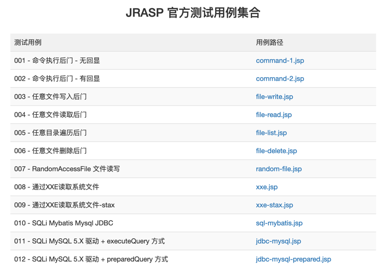

# 测试用例

## 测试用例1
> **测试用例来源于open-rasp，有删改**

为了验证JRASP的漏洞检测效果，我们提供了多个测试用例，覆盖常见高危漏洞。测试用例的部署也非常简单，复制到 webroot/webapps 目录即可。

### 下载
```
wget https://jrasp-1254321150.cos.ap-shanghai.myqcloud.com/jrasp-vulns.war
```

### 运行

将 `jrasp-vulns.war` 复制 tomcat 或者 jetty 的 webapps 下
启动web容器，打开链接 

http://localhost:8080/jrasp-vulns/


