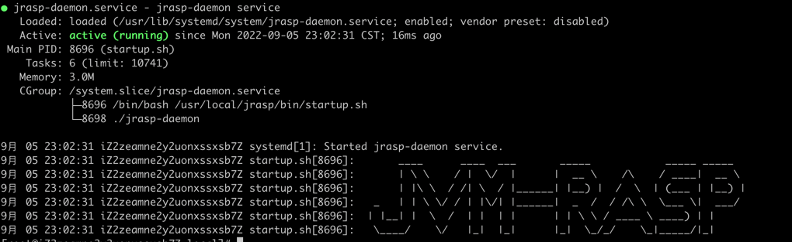
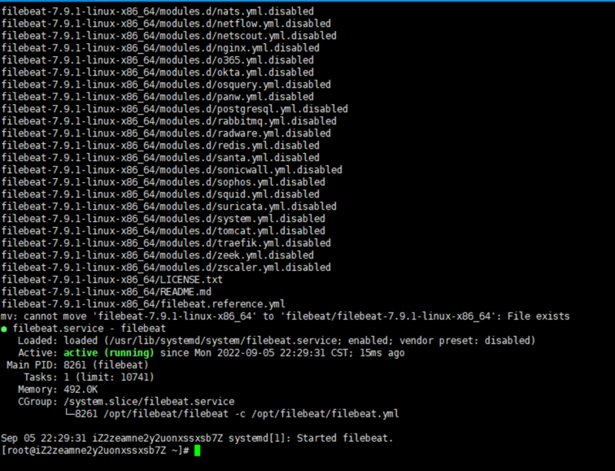
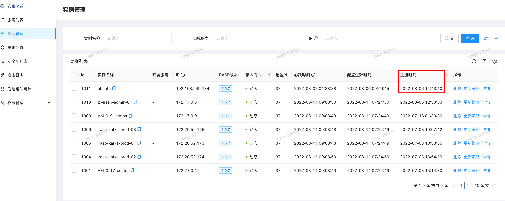
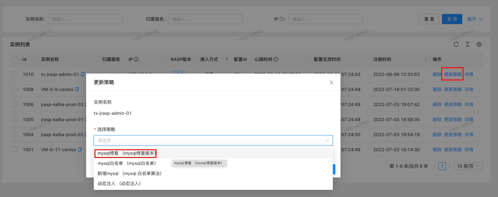

# 快速安装(使用管理端)

> jrasp 在腾讯云/阿里云上部署了jrasp的基础设施

> 仅需要安装jrasp-agent，即可接入到jrasp云端管控平台，快速体验jrasp功能!!

> 仅需2行命令即可以完成安装！！

> 仅限centos

> root 权限安装

## 第一步 安装 agent

```
curl https://jrasp-download.oss-cn-shanghai.aliyuncs.com/jrasp-install.sh|bash
```

上面的脚本执行成功之后：



注意：安装目录在`/usr/local/jrasp`下,如果已经安装过1.0.8及以下版本，请先将`jrasp`目录删除再安装

## 第二步 安装 filebeat

```
curl https://jrasp-download.oss-cn-shanghai.aliyuncs.com/filebeat-install.sh|bash
```



(如果脚本下载失败，请尝试手动安装[filebeat install](./v1.1.0/filebeat.md))

## 登陆管理端

[云端管控平台地址](http://132.232.32.246/host/index)

查看是agent否成功注册

用户名称：user2022 密码：123456



## 下发最新配置 （1.1.0内置了最新配置，无需更新配置，可以跳过）



约等待`30s`，配置生效

## 安装失败,请确认下面的问题

+ 仅限 centos

+ 必须`root`权限安装

+ jrasp-daemon进程是否启动  `ps -ef|grep jrasp-daemon`

+ jrasp 的安装目录在 `/usr/local/jrasp`  （排查多个用户安装失败情况，大部分原因是这个）

+ filebeat的安装目录在`/usr/local/filebeat` 


