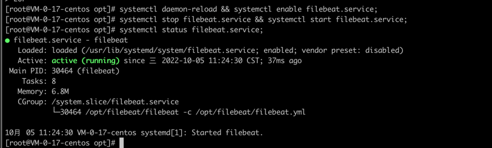
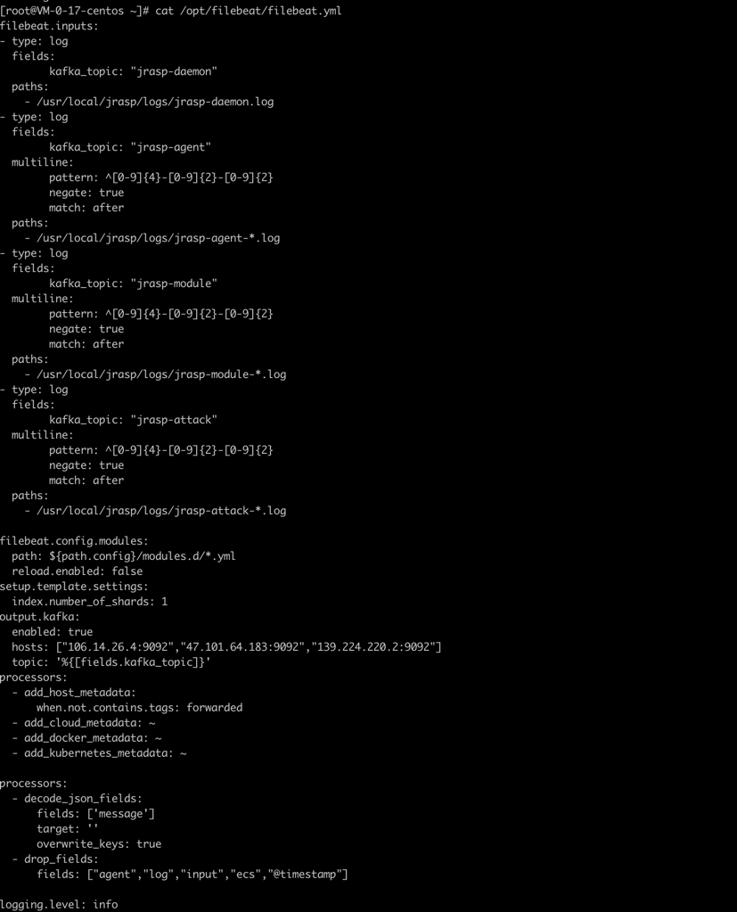

# filebeat安装

> 安装教程适配 JRASP v1.1.0

> 本节将安装filebeat，并配置开启自动启动配置

filebeat需要安装到每个节点上，作用是将 jrasp-daemon、jrasp-module、jrasp-agent、jrasp-attack日志收集到kafka中。

上一节中，安装了kafka集群，集群地址：
106.14.26.4、47.101.64.183、139.224.220.2
将地址配置到filebeat的配置文件中的`output.kafka.hosts`项

## 安装命令 （2023-01-17 更新）

+ 仅限centos，其他系统如ubuntu、windows请根据下面的命令自行修改

+ 安装目录在`/usr/local/filebeat` ，请勿修改！！！

+ 监控的日志文件路径在`/usr/local/jrasp/logs` 请勿修改！！！

复制下面的脚本在终端执行即可
```json
## fileBeat 安装目录
fileBeatHome=/usr/local/filebeat
## 日志目录
logDir=/usr/local/jrasp/logs
## 多行合并策略       
pattern='^[0-9]{4}-[0-9]{2}-[0-9]{2}'
cd /usr/local/ && yum install wget -y && wget https://repo.huaweicloud.com/filebeat/7.9.1/filebeat-7.9.1-linux-x86_64.tar.gz;
tar -zxvf filebeat-7.9.1-linux-x86_64.tar.gz -C /usr/local/ && mv filebeat-7.9.1-linux-x86_64 filebeat && rm -rf filebeat-7.9.1-linux-x86_64.tar.gz;
cat << EOF > ${fileBeatHome}/filebeat.yml
filebeat.inputs:
- type: log
  fields:
        kafka_topic: "jrasp-daemon"
  paths:
    - ${logDir}/jrasp-daemon.log
- type: log
  fields:
        kafka_topic: "jrasp-agent"
  multiline:
        pattern: $pattern
        negate: true
        match: after      
  paths:
    - ${logDir}/jrasp-agent-*.log
- type: log
  fields:
        kafka_topic: "jrasp-module"
  multiline:
        pattern: $pattern
        negate: true
        match: after
  paths:
    - ${logDir}/jrasp-module-*.log
- type: log
  fields:
        kafka_topic: "jrasp-attack"
  multiline:
        pattern: $pattern
        negate: true
        match: after        
  paths:
    - ${logDir}/jrasp-attack-*.log
        
filebeat.config.modules:
  path: \${path.config}/modules.d/*.yml
  reload.enabled: false
setup.template.settings:
  index.number_of_shards: 1
output.kafka:
  enabled: true
  hosts: ["106.14.26.4:9092","47.101.64.183:9092","139.224.220.2:9092"]
  topic: '%{[fields.kafka_topic]}'
processors:
  - add_host_metadata:
      when.not.contains.tags: forwarded
  - add_cloud_metadata: ~
  - add_docker_metadata: ~
  - add_kubernetes_metadata: ~

processors:
  - decode_json_fields:
      fields: ['message']
      target: ''
      overwrite_keys: true
  - drop_fields:
      fields: ["agent","log","input","ecs","@timestamp"]

logging.level: info
EOF
## systemctl
cat << EOF > /usr/lib/systemd/system/filebeat.service
[Unit]
Description=filebeat
Wants=network-online.target
After=network-online.target
[Service]
User=root
ExecStart=${fileBeatHome}/filebeat -c ${fileBeatHome}/filebeat.yml
Restart=always
[Install]
WantedBy=multi-user.target
EOF
systemctl daemon-reload && systemctl enable filebeat.service;
systemctl stop filebeat.service && systemctl start filebeat.service;
systemctl status filebeat.service;
```

### 安装成功

+ filebeat启动成功



+ 确认配置



上面的安装命令在centos上已经执行过上千次了，基本无问题。如果安装失败，请仔细检查filebeat的`安装路径`和`日志监控路径`是否正确。


