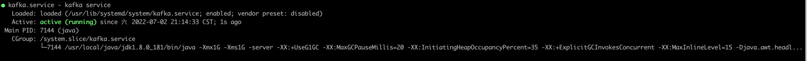

# kafka 集群安装

> 安装教程适配 JRASP v1.1.0

上一篇中，我们安装了zookeeper集群，zookeeper节点的地址：

172.20.52.173、172.20.52.174、172.20.52.175

本节安装kafka集群，为节省资源，这里将 kafka 与 zookeeper 安装在同一机器上

## 集群节点

准备了3台机器, 节点配置4核8GB内存50GB磁盘

|节点编号|内网地址|外网地址|
|:----:|:----:|:----:|
|1|172.20.52.173|106.14.26.4|
|2|172.20.52.174|47.101.64.183|
|3|172.20.52.175|139.224.220.2|

## 安装命令
> 如果已经有kafka集群，可以跳过此安装步骤。进入到下一步 topic创建
+ kafka 安装目录是 /opt/kafka
+ 执行下面的脚本前，请修改 broker.id、listeners、advertised.listeners 为对应节点信息
### 将下面的命令复制到终端执行
```json
mkdir -p /opt/kafka;        
wget https://repo.huaweicloud.com/apache/kafka/2.8.0/kafka_2.13-2.8.0.tgz;
tar -zxvf kafka_2.13-2.8.0.tgz -C /opt/kafka;
## 配置server.properties
cat << EOF > /opt/kafka/kafka_2.13-2.8.0/config/server.properties;
## 节点集群编号
broker.id=3
## 节点内网地址        
listeners=PLAINTEXT://172.20.52.175:9092
## 节点外网地址
advertised.listeners=PLAINTEXT://139.224.220.2:9092
num.network.threads=3
num.io.threads=8
socket.send.buffer.bytes=102400
socket.receive.buffer.bytes=102400
socket.request.max.bytes=104857600
log.dirs=/tmp/kafka-logs
num.partitions=1
num.recovery.threads.per.data.dir=1
offsets.topic.replication.factor=1
transaction.state.log.replication.factor=1
transaction.state.log.min.isr=1
log.retention.hours=168
log.segment.bytes=1073741824
log.retention.check.interval.ms=300000
zookeeper.connect=172.20.52.173:2181,172.20.52.174:2181,172.20.52.175:2181
zookeeper.connection.timeout.ms=18000
group.initial.rebalance.delay.ms=0
EOF
##  自动拉起与开机启动       
cat << EOF > /usr/lib/systemd/system/kafka.service;
[Unit]
Description=kafka service

[Service]
Type=simple
Environment=JAVA_HOME=/usr/local/java/jdk1.8.0_181
ExecStart=/opt/kafka/kafka_2.13-2.8.0/bin/kafka-server-start.sh /opt/kafka/kafka_2.13-2.8.0/config/server.properties
ExecStop=/opt/kafka/kafka_2.13-2.8.0/bin/kafka-server-stop.sh
Restart=always

[Install]
WantedBy=multi-user.target
EOF

systemctl daemon-reload
systemctl enable kafka
systemctl stop kafka        
systemctl start kafka
systemctl status kafka
```

注意：执行上面的脚本前，请修改 broker.id、listeners、advertised.listeners 为对应节点信息
+ broker.id 是节点编号依次为1、2、3
+ listeners 是该节点的内网地址
+ advertised.listeners 是该节点的外网地址

安装成功：



## topic 创建

创建 jrasp-daemon、jrasp-agent、jrasp-module、jrasp-attack【v1.1.0 新增】 4个topic
```json
./kafka-topics.sh --zookeeper 172.20.52.173:2181,172.20.52.174:2181,172.20.52.175:2181 --create --topic jrasp-daemon --partitions 3 --replication-factor 3
./kafka-topics.sh --zookeeper 172.20.52.173:2181,172.20.52.174:2181,172.20.52.175:2181 --create --topic jrasp-agent --partitions 3 --replication-factor 3
./kafka-topics.sh --zookeeper 172.20.52.173:2181,172.20.52.174:2181,172.20.52.175:2181 --create --topic jrasp-module --partitions 3 --replication-factor 3
./kafka-topics.sh --zookeeper 172.20.52.173:2181,172.20.52.174:2181,172.20.52.175:2181 --create --topic jrasp-attack --partitions 3 --replication-factor 3
```

误操作时删除topic：
```json
./kafka-topics.sh --zookeeper 172.20.52.173:2181,172.20.52.174:2181,172.20.52.175:2181 --delete  --topic jrasp-daemon
```
