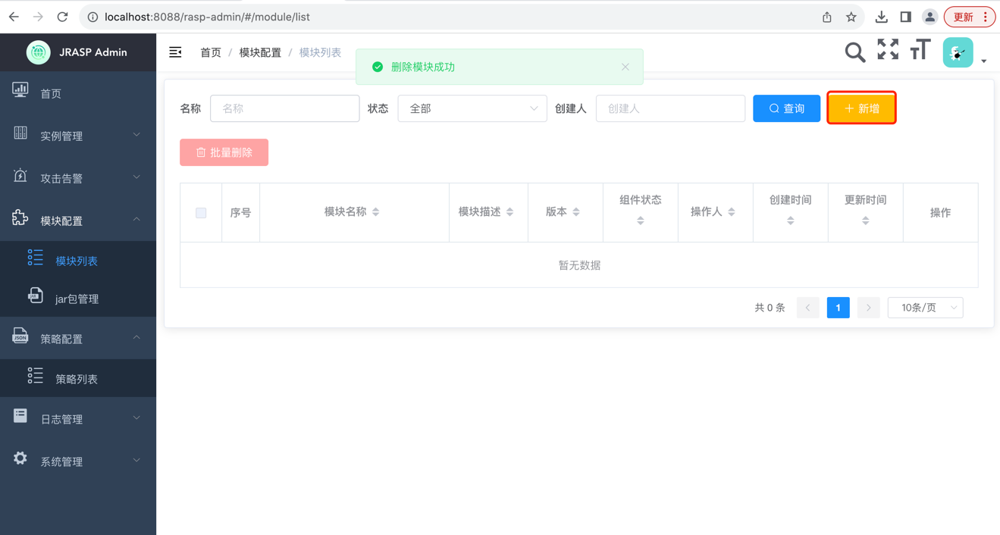
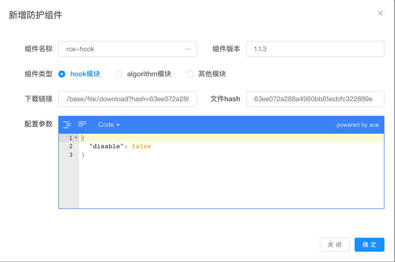
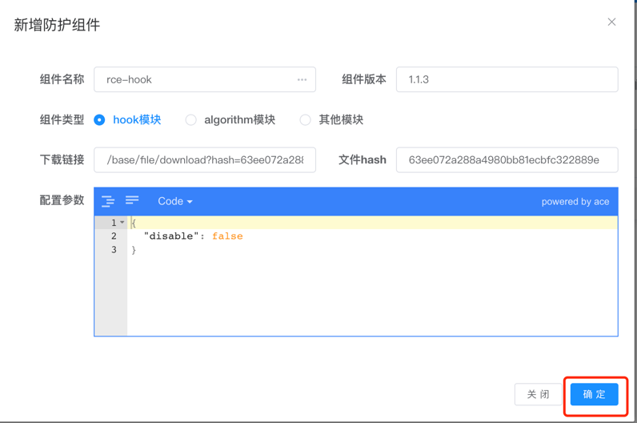
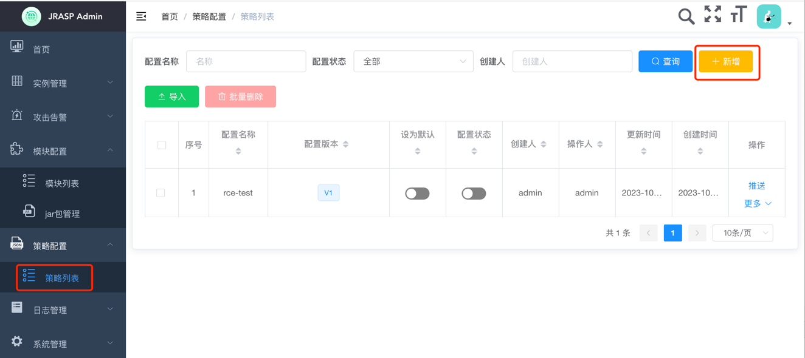
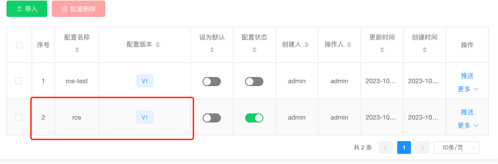
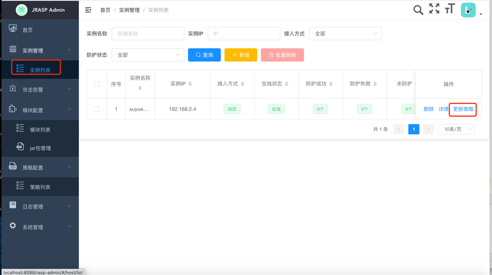
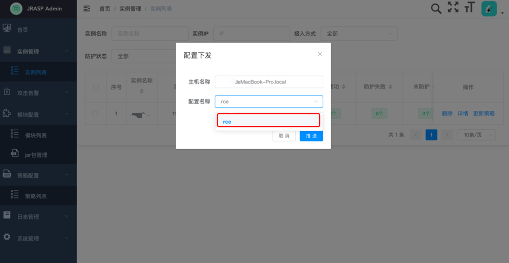
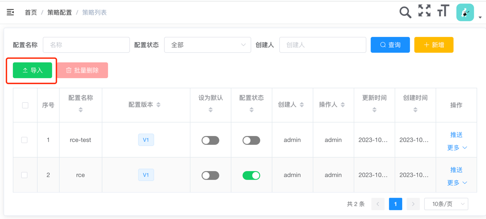

# 创建配置

> jrasp-agent 安装包中包含了默认配置，能满足一般情况的使用，如果需要定制策略，则需要对配置进行修改

## 01.模块jar包上传

将模块批量上传到管理端。

模块可以来自于jrasp-agent安装包或者jrasp-agent源码编译输出

## 0.2模块配置

一个防护组件一般包含2个jar包（hook模块+算法模块）

先添加rce-hook模块

选中模块后，显示可以配置的参数 

确定

在此添加rce-algorithm模块

添加2个模块后，一个防护组件就完成了

确认模块其他信息

## 0.3新增配置

选择刚才生成的rce-test （其他防护模块生成方式一样）

生成的配置：

## 0.4配置下发

## 0.5 策略包导出

上面配置过程较为繁琐，20+jar包配置比较复杂。但是配置一次之后，就可以复用了。

如果有多个管理端，可以将刚才导出的压缩包倒入到新的管理端中，避免反复配置。

