# 私有化安装教程

> 适配 jrasp-agent/web 1.1.5 版本

### 01.管理端安装

准备一台机器2核4G 以上配置，ip地址：117.68.117.6（外网），10.0.0.131（内网）

这里提供一个linux系统的编译版本。windows/macos请下载源码自行编译。

+ 下载web管理端
```shell
wget https://www.download.jrasp.com/v1.1.3/jrasp-agent/jrasp-server-bin-20231024082023.tar.gz
```
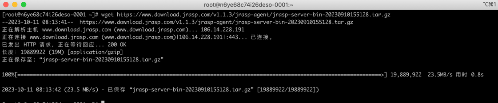

+ 解压安装
```shell
tar -zxvf jrasp-server-bin-20231024082023.tar.gz
```


+ 进入安装目录下
```shell
cd server
```


+ 启动server
```shell
./server
```
或者后台启动：
```
nohup ./server >/dev/null 2>&1 &
```
启动日志：


+ 开启https（需要申请域名、**可选**）

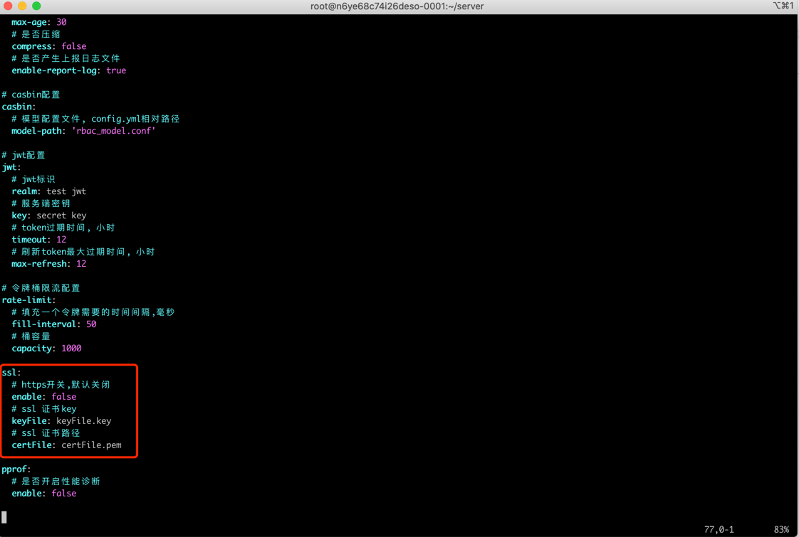
这里默认关闭

+ 登录管理端

http://117.68.117.6:8088/rasp-admin

admin 123456


管理端界面：

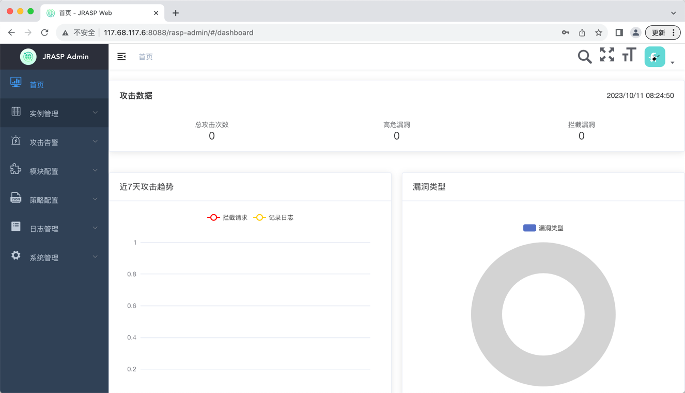

### 02.jrasp agent安装

我这里在另外一台机器上安装，ip 地址：117.68.117.154

+ 下载 agent
```shell
wget https://www.download.jrasp.com/v1.1.5/jrasp-1.1.5-linux-amd64-bin.tar.gz
```


+ 解压到指定目录/usr/local/
```java
tar -zxvf jrasp-1.1.3-linux-amd64-bin.tar.gz -C /usr/local/
```


+ 进入解压目录

```java
cd /usr/local/jrasp
```

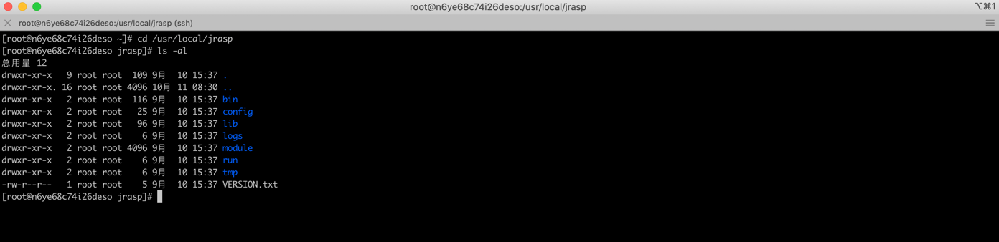

+ 进入配置目录config，增加服务端地址

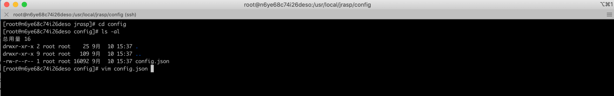
增加配置项
```java
"remoteHosts":["ws://117.68.117.6:8088/rasp-admin"],
```

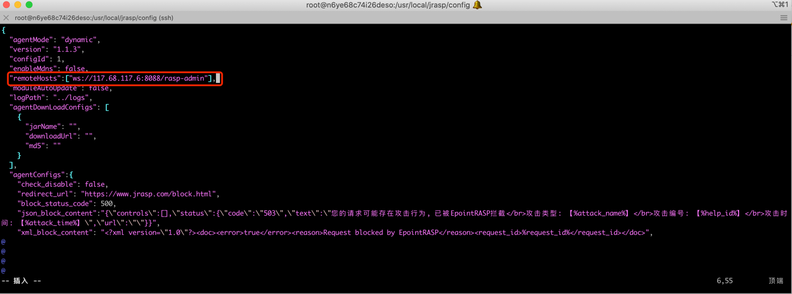

+ 进入可执行目录bin

```java
cd ../bin
```


+ 启动jrasp-daemon

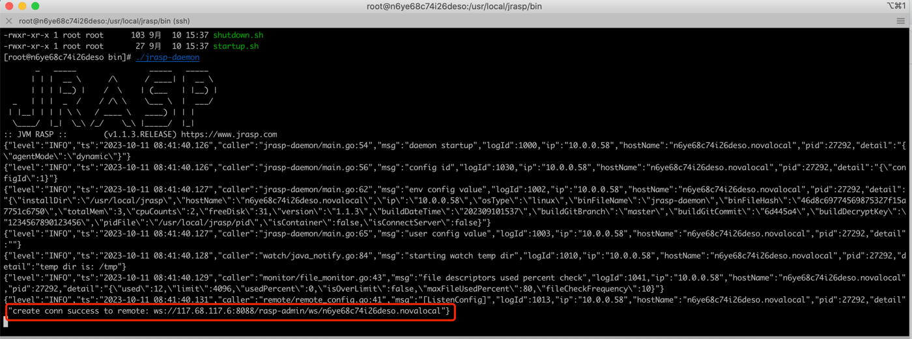


> jrasp-daemon需要配置守护进程！！！
```java
cat << EOF > /usr/lib/systemd/system/jrasp-daemon.service
[Unit]
Description=jrasp-daemon service

[Service]
Type=simple
WorkingDirectory=/usr/local/jrasp/bin
ExecStart=/usr/local/jrasp/bin/jrasp-daemon
ExecStop=/bin/kill $MAINPID
Restart=always
StandardOutput=null
StandardError=null
[Install]
WantedBy=multi-user.target
EOF

## 设置开机启动与自动拉起
systemctl daemon-reload;
systemctl enable jrasp-daemon.service;
systemctl stop jrasp-daemon.service;
systemctl start jrasp-daemon.service;
systemctl status jrasp-daemon.service;
```


### 03.安装日志传输工具filebeat

+ 下载定制的filebeat
```java
wget https://www.download.jrasp.com/filebeat/filebeat-1.1.3-linux-x86_64.tar.gz
```


+ 解压到指定目录/usr/local/
```java
tar -zxvf filebeat-1.1.3-linux-x86_64.tar.gz -C /usr/local/
```


+ 进入到 filebeat 的解压目录
```java
cd /usr/local/filebeat
```
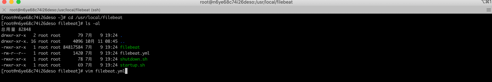

+ 修改filebeat的监控的日志路径和上报的服务端地址

```java
vim filebeat.yml
```
修改监控的日志目录，我这边 jrasp 安装到了`/usr/local/jrasp`

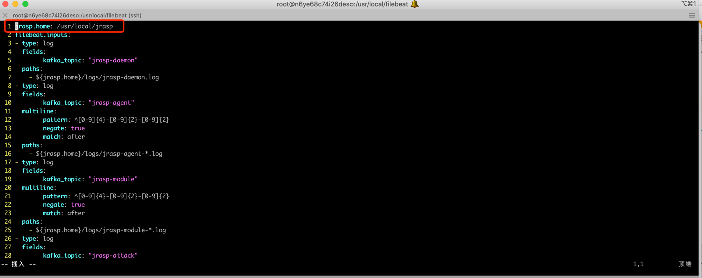

修上报的服务端地址，我这边服务端地址为：

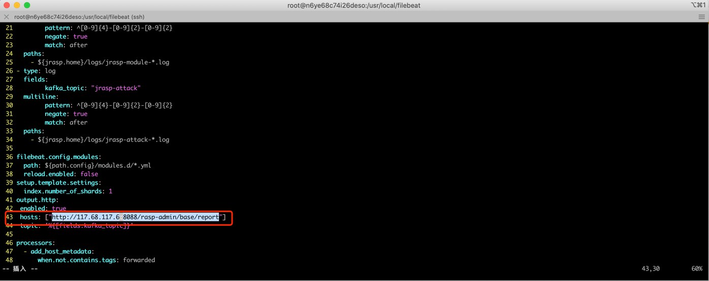

+ 启动 filebeat
```java
./startup.sh
```


### 攻击测试
以上安装完成后，主机注册到管理端上：


+ 启动测试的Java进程

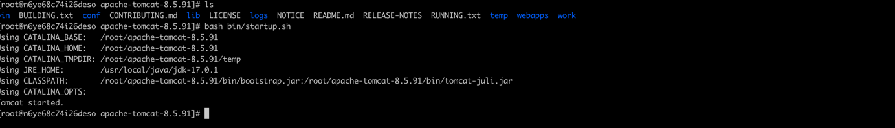


+ 注入成功

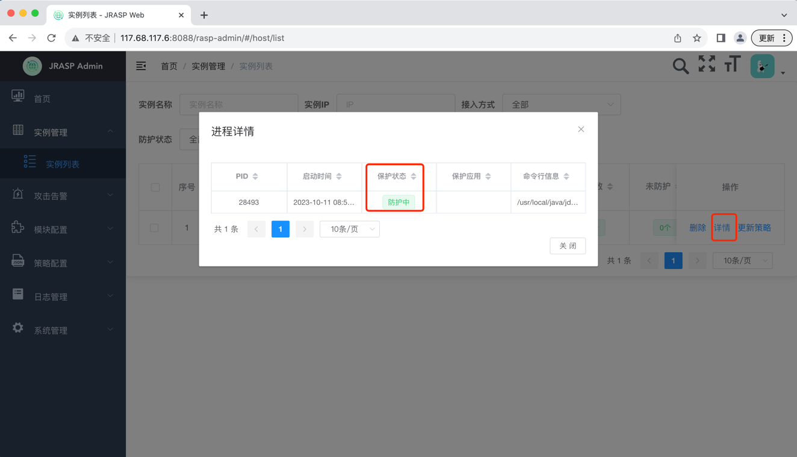

