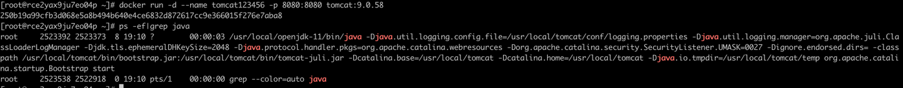
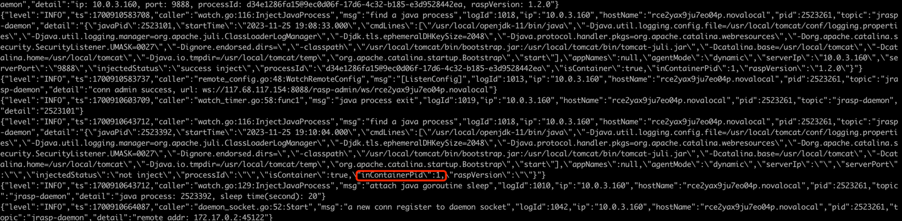
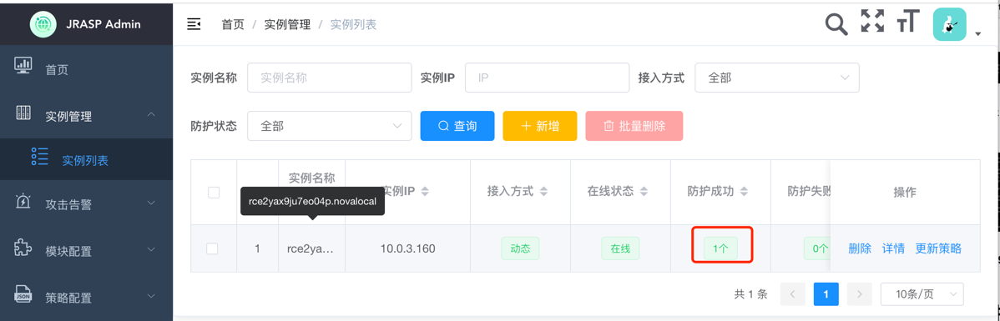
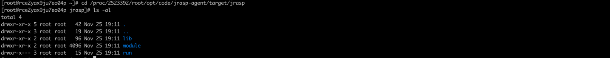
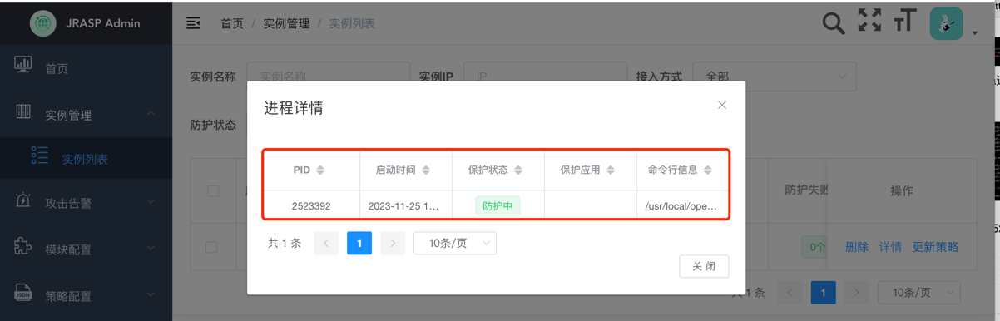
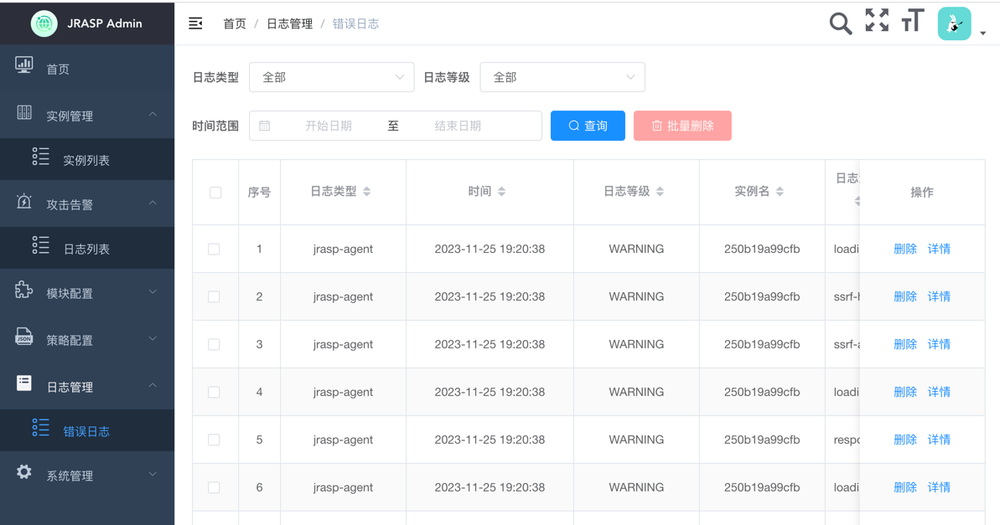
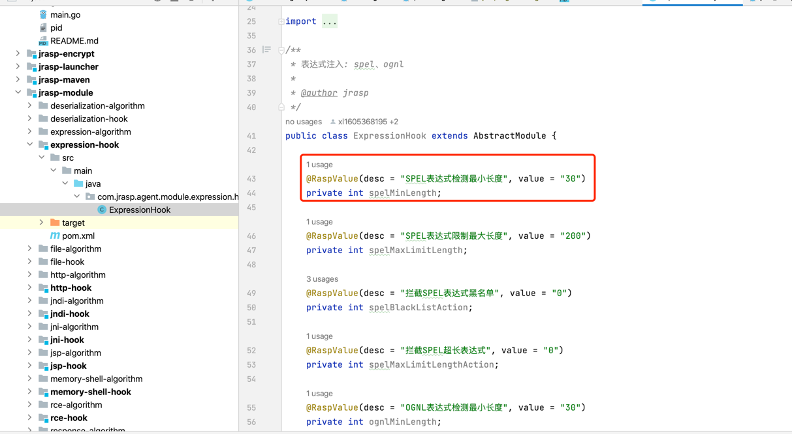

# jrasp 1.2.0 版本特性说明

+ 在宿主机上启动一个tomcat docker镜像

+ 启动jrasp守护进程daemon，自动发现Java进程（包括容器中Java进程）

+ 容器中Java进程pid为1，宿主机上进程为2523392

+ 控制台上看到进程

## 特性1：注入容器中Java进程

进入到进程/proc目录，jrasp 需要的安装包已经自动安装到了容器中了（不包含 jrasp-daemon）。

进程已经处于防护状态

## 特性2：日志传输使用socket

1.1.x 版本日志写入磁盘，需要借助logagent完成日志收集和投递；

1.2.x 版本不再需要安装logagent；

所有日志通过socket传输到控制台，agent或者daemon断开连接后日志写入磁盘，重连后自动回传离线日志；

## 特性3： 配置自动提取

编译时通过@RaspValue注解提取配置参数

注：1.2.x 将是2024年主要维护版本