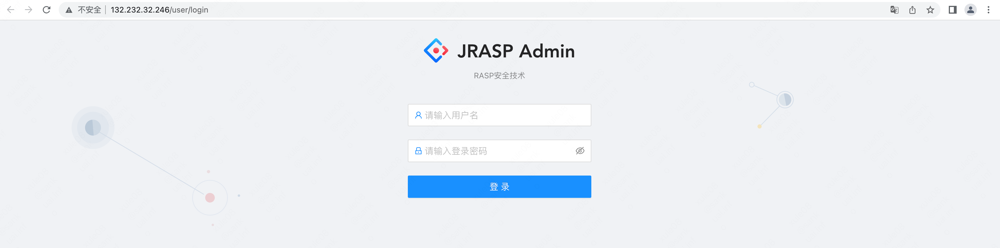
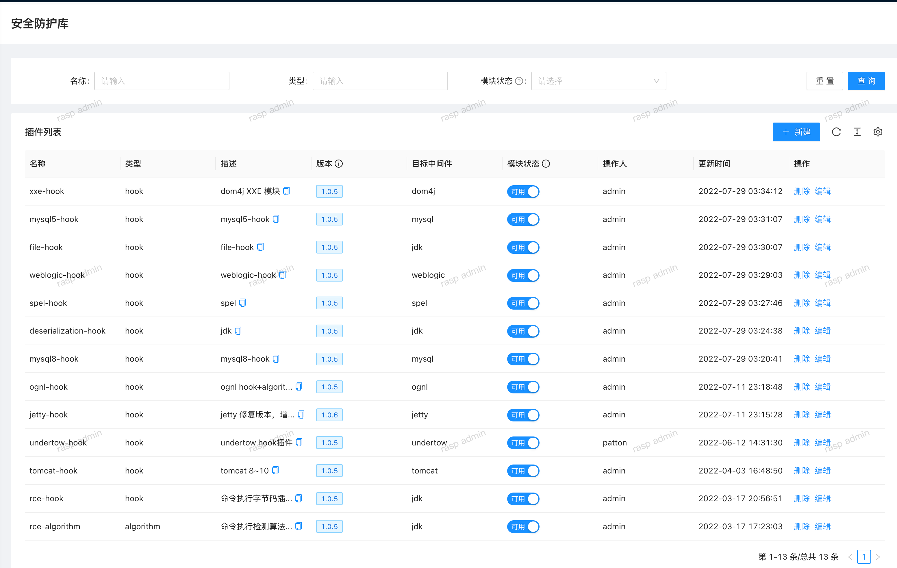
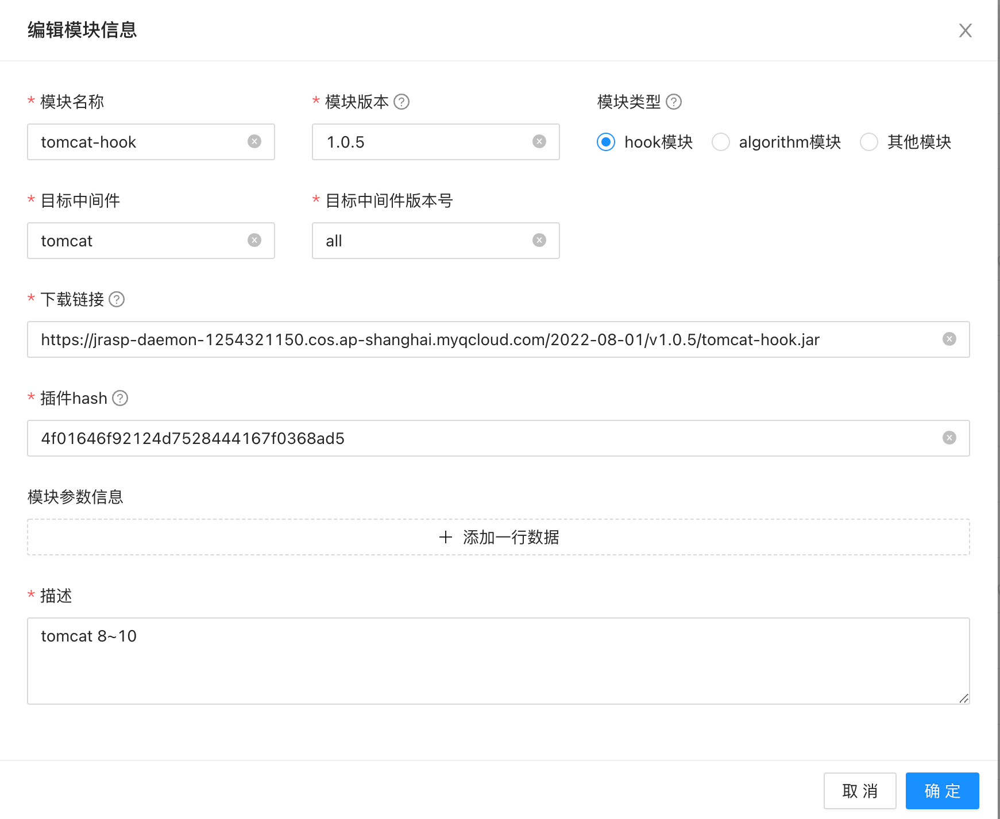

# 管理端

## 管理端地址
为了方便用户体验，我们搭建了jrasp管理端，地址如下：

[管理端地址](http://132.232.32.246)

登陆账号密码请微信联系`sear2022`获取

## 安装 jrasp-agent

[jrasp-agent 安装](../../developer/README.md)

## 新增插件配置

这里以一个`tomcat-hook`模块为例子说明

