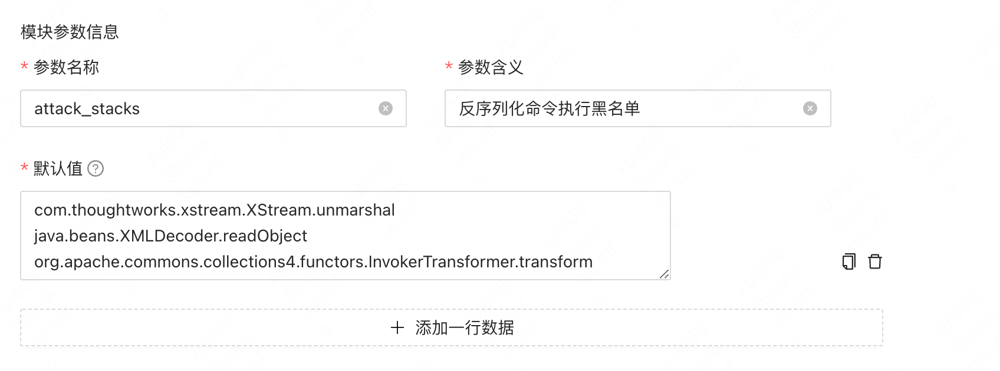

# 产品特点

**Java Runtime Application Self-Protection** 意思是Java应用自我保护系统，简称 **JRASP**

## 优越的性能

### 代码插桩性能高
&emsp;&emsp;实现 JavaAgent 代码插桩的框架主要有 ASM、Javassist 和 Byteman 等。三者对比之下，ASM 在这几个框架里插桩效率是最高的，我们使用 ASM 来对字节码进行修改，最大限度的提升性能；[性能比较](../../boke/performance/asm.md)

### 检测引擎低延时
&emsp;&emsp;抛弃了第三方规则引擎，使用Java原生语言实现检测。基于对各种规则引擎做了充分的性能测试，包括 Google V8 引擎、groovy脚本引擎、jdk自带的rhino引擎等，
测试发现一条规则的性能优化到极限耗时也有0.5ms，达不到我们的高负载下的延时要求；而实现相同规则，java原生代码耗时仅0.1ms，如果检测逻辑经过充分预热，耗时会更低。基于对第三方规则引擎和原生检测逻辑的性能对比，我们采用了java原生代码来实现规则检测
。尽管业内大多采用了Google V8引擎，在不同语言环境实现了检测规则的通用性，从大规模实践来看，规则引擎的通用性并不是痛点，RASP部署的最大痛点之一是检测逻辑的性能损耗</font>。

### 降低注入对服务的影响
&emsp;&emsp;为了尽可能的降低 agent注入对服务的性能影响，我们创造性的实现了一系列功能，包括注入前的系统负载检查，并实现了自动寻找低峰期开启注入，注入过程无需人为干预；
注入后系统负载高的<font color='red'>无损降级</font>与<font color='red'>自熔断</font>的功能，最大程度的减少 RASP 对系统性能的影响。

### 资源占用小
&emsp;&emsp; 不依赖log4j、json和apache等工具包，仅ASM字节码修改工具，核心jar包仅600KB, 运行时内存等占用极小。

### 分体式设计 

&emsp;&emsp;将非必要进入到java agent的逻辑，如配置感知、插件更新和日志回传等，抽离出独立守护进程，java agent仅字节码修改与保留检测逻辑，从而尽可能减少对JVM资源占用，同时系统的隔离等级由类加载器隔离提升到进程隔离。


## 强大的灵活性

### 插件可定制

虽然我们对常用开源中间件如tomcat、jetty、springboot等做了支持，一般企业内部会有自研、对各种开源组件包装加壳等操作来适应企业自身的基础设施，
只需要简单的遵循插件开发规范，就可以开发贴合企业架构的插件。

### 安全插件jar热插拔
安全插件按照中间件和功能分类，每个插件都能实现热加载和热卸载；（称之为插件版本升级）

### 检测参数实时更新

每个安全插件都支持参数更新(如黑白名单等);（称之为参数更新）


### 同时支持2种部署方式

java agent的部署方式有2种：premain方式和agentmain方式，2种方式各有利弊，JRASP同时支持。


## 为大规模部署而生
&emsp;&emsp;传统的RASP通过修改 Tomcat、Jetty 和 Springboot 等的启动脚本，给JVM增加 javaagent 参数来让JVM加载一个Java Agent。一般这样启动一个Java Agent：
```
java -javaagent:/path/to/your/agent.jar -jar XXX.jar
```
&emsp;&emsp;这种部署方式首先要知道 web 容器的安装路径，然后还要修改JVM参数配置文件，最后重启 web 容器，RASP 部署才算生效。小规模机器上能够使用，如果是几十万台甚至上百万台主机上，这将是一场[运维灾难](https://www.freebuf.com/articles/es/235441.html) ；

&emsp;&emsp;我们自研的 RASP 具有自动发现Java进程和依赖的中间件jar包，并根据中间件类型和版本自动下载和加载对应插件jar包，全过程 Java 服务**无需要修改参数**，也**无需重启**, 真正实现了对业务的零打扰；

&emsp;&emsp;实现原理：RASP 守护进程发现了 Java 进程之后，对Java进程依赖的jar包进行分析，从对象存储服务下载对应 jar 包的插件到目标主机上，然后 attach 到目标 JVM 上，目标 JVM 在初始化一个 **轻量级的 Agent (仅一个类)**，最后动态加载核心插件 jar 包。

## 一键部署与跨平台
&emsp;&emsp; RASP 在 macos、linux 和 windows 环境下分别提供了一键部署的安装包，仅需一个命令即可以开启 RASP 防护。


## 支持native方法hook

例如：一般的rasp命令执行的hook点是`java.lang.UNIXProcess.<init>` 或者  `java.lang.ProcessImpl.start`,存在绕过的风险，jrasp支持最底层的native方法`forkAndExec`,在java层面难以绕过


## 专注于入侵检测

&emsp;&emsp;我们自研的 RASP 抛弃了之前开源和商业 RASP 产品大而全的方案，专注解决掉入侵相关的风险，同时也做得更底层，在 Java 运行时环境做了比较多的适配。

## 自身安全性

"打铁还需自身硬",JRASP在防护业务安全的同时，也十分重视自身安全性建设。JRASP的防护策略(包括hook类、参数检测逻辑等)仍然一定程度上于依赖信息不对称, 如何保障策略在传输过程、运行时不被恶意窃取分析是一个重要问题。
JRASP对整个通信链路进行了加密，包括：
+ 管理端下发给守护进程的的安全策略加密；
+ 守护进程与agent通信的socket加密，防止插件被控制；
+ 插件jar包传输全过程加密，在类加载时解密，最大程度防止jar包被反编译；

## 产品对标

|产品特性|阿里JAM*|百度OpenRASP|字节 AgentSmith|JRASP|
|:------:|:----:|:----:|:--------:|:--------:|
|性能影响|rt<0.5ms, cpu<1%, mem<100m|cpu<3%,rt<5ms|-|rt<0.5ms, cpu<2%, mem<100m|
|hook入口|http、rpc|http、rpc|http、rpc|http、rpc|
|hook行为|rce、file、net|rce、file、net、classloader|...|rce、file、net、xxe|
|部署方式|premain|premain|agentmain|都支持|
|多语言|java(主要)、nodejs、python|java、php|go、java、python|java|
|自身安全|全链路加密|jar包、策略明文|jar包混淆|全链路加密|


## 白皮书下载

[jrasp白皮书](https://jrasp-1254321150.cos.ap-shanghai.myqcloud.com/pdf/JRASP%E4%BA%A7%E5%93%81%E7%99%BD%E7%9A%AE%E4%B9%A6.pdf)

感谢`Holy`提供白皮书，现任某大型国有银行信息科技部应用安全高级工程师
