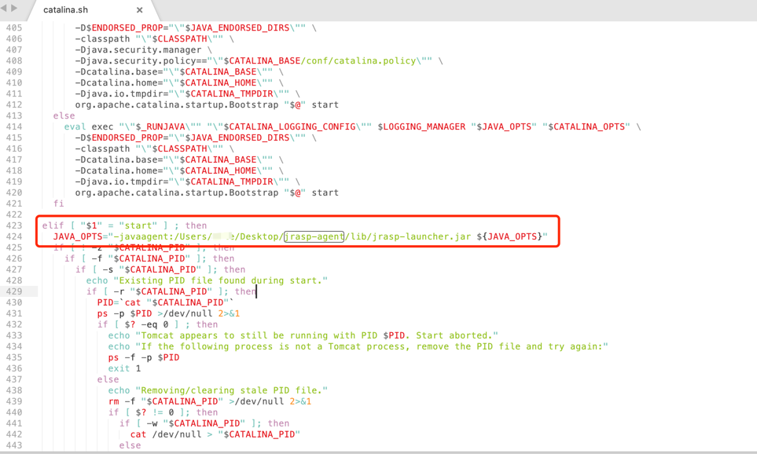

# 单机运行

jrasp-agent 有`启动时`和`运行时`两种启动方式，两种方式各有利弊，JVM启动时加载对业务性能影响小，而JVM运行时加载使用更加灵活。

## 运行时加载

```shell
./jrasp.sh -p 56044
```
返回结果
```json
{"code":200,"data":{"mode":"ATTACH","raspHome":"/Users/xxxx/Desktop/jrasp/bin/..","version":"1.0","username":"admin"}}
```
运行时加载只需要知道Java进程的pid即可，不受限于JVM启动时机，非常灵活方便，但是在JVM运行时如果负载较高，**加载时造成系统CPU短暂升高[（参考：attach时性能影响）](../faq/faq.md#_4-attach之后对原进程性能有多大的影响)**，可能会影响业务正常运行。

## 启动时加载

### SpringBoot
springboot 带上 jrasp-launcher.jar
```shell
java -javaagent:/path/to/jrasp-launcher.jar -jar application.jar
```
### Tomcat

以`apache-tomcat-9.0.34` 为例子来说明

打开 bin/catalina.sh, 找到如下内容(catalina.sh的第423行)：
```shell
elif [ "$1" = "start" ] ; then
  
  if [ ! -z "$CATALINA_PID" ]; then
```
修改为如下（增加 -javaagent 项）

```shell
elif [ "$1" = "start" ] ; then
  JAVA_OPTS="-javaagent:/path/to/your/jrasp-agent/lib/jrasp-launcher.jar ${JAVA_OPTS}"
  if [ ! -z "$CATALINA_PID" ]; then
```
修改后的参数如下图：



### Jetty

修改 java 启动参数，增加 -javaagent 参数（注意将 -jar 放在命令最末尾):
```shell
java -javaagent:/path/to/your/jrasp-agent/lib/jrasp-launcher.jar -jar start.jar
```

上述修改启动脚本的方式不是很灵活，需要业务高度配合，可以修改Java进程的环境变量来做
```shell
export JAVA_TOOL_OPTIONS=-javaagent:/path/to/your/jrasp-agent/lib/jrasp-launcher.jar
```

## 启动时和运行时如何选择

+ 如果不能容忍 jrasp 启动时Java进程的CPU/TP线/Code cache等抖动，请选择启动时加载；其他场景请使用运行时启动；

+ 运行时加载时可以切走流量，等待Java Agent初始化完成之后，再将流量切回来，也可以避免CPU抖动【**推荐**】;

