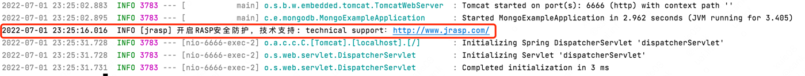
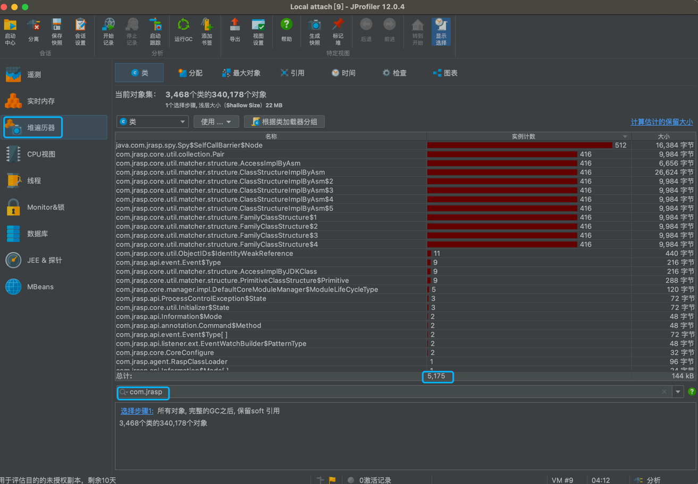

# 卸载RASP


## 加载jrasp

```shell
./jrasp.sh -p 56044
{"code":200,"data":{"mode":"ATTACH","raspHome":"/Users/xxxx/Desktop/jrasp/bin/..","version":"1.0","username":"admin"}}

点击链接获得技术支持: https://www.jrasp.com/
```

业务日志出现jrasp开启防护日志：
```shell
开启RASP安全防护，技术支持: technical support：https://www.jrasp.com
```


查看已经加载的类 `jmap -histo:live 56044 | grep com.jrasp`
```
  56:           411          26304  com.jrasp.core.util.matcher.structure.ClassStructureImplByAsm
  78:           512          16384  java.com.jrasp.spy.Spy$SelfCallBarrier$Node
 112:           411           9864  com.jrasp.core.util.collection.Pair
 113:           411           9864  com.jrasp.core.util.matcher.structure.ClassStructureImplByAsm$2
 114:           411           9864  com.jrasp.core.util.matcher.structure.ClassStructureImplByAsm$3
 115:           411           9864  com.jrasp.core.util.matcher.structure.ClassStructureImplByAsm$4
 116:           411           9864  com.jrasp.core.util.matcher.structure.ClassStructureImplByAsm$5
 117:           411           9864  com.jrasp.core.util.matcher.structure.FamilyClassStructure$1
 118:           411           9864  com.jrasp.core.util.matcher.structure.FamilyClassStructure$2
 119:           411           9864  com.jrasp.core.util.matcher.structure.FamilyClassStructure$3
 120:           411           9864  com.jrasp.core.util.matcher.structure.FamilyClassStructure$4
 159:           411           6576  com.jrasp.core.util.matcher.structure.AccessImplByAsm
 276:             1           2064  [Ljava.com.jrasp.spy.Spy$SelfCallBarrier$Node;
 339:            50           1200  com.jrasp.api.listener.ext.EventWatchBuilder$PatternGroupList
 473:            10            560  com.jrasp.core.manager.impl.RASPClassFileTransformer
 502:            10            480  com.jrasp.core.CoreModule
 503:             4            480  com.jrasp.core.classloader.ModuleJarClassLoader
 517:            12            472  [Lcom.jrasp.api.event.Event$Type;
 525:            11            440  com.jrasp.core.util.ObjectIDs$IdentityWeakReference
 550:            10            400  com.jrasp.api.listener.ext.EventWatchBuilder$BuildingForBehavior
 551:            10            400  com.jrasp.api.listener.ext.EventWatchBuilder$BuildingForClass
 606:            10            320  com.jrasp.core.enhance.weaver.EventProcessor
 632:             9            288  com.jrasp.core.util.matcher.structure.PrimitiveClassStructure$Primitive
 679:            10            240  [Lcom.jrasp.core.util.matcher.Matcher;
 685:            10            240  com.jrasp.api.filter.ExtFilter$ExtFilterFactory$1
 686:            10            240  com.jrasp.api.listener.ext.AdviceAdapterListener
 687:            10            240  com.jrasp.api.listener.ext.AdviceAdapterListener$1
 688:            10            240  com.jrasp.api.listener.ext.AdviceAdapterListener$3
 689:            10            240  com.jrasp.api.listener.ext.EventWatchBuilder
 690:            10            240  com.jrasp.api.listener.ext.EventWatchBuilder$1
 691:            10            240  com.jrasp.core.enhance.weaver.EventProcessor$1
 692:            10            240  com.jrasp.core.manager.impl.AffectStatistic
 729:             9            216  com.jrasp.api.event.Event$Type
 730:             9            216  com.jrasp.core.util.matcher.structure.AccessImplByJDKClass
 749:             5            200  com.jrasp.core.manager.impl.DefaultModuleEventWatcher
 852:            10            160  com.jrasp.core.util.matcher.ExtFilterMatcher
 853:            10            160  com.jrasp.core.util.matcher.GroupMatcher$Or
 890:             6            144  com.jrasp.core.util.RaspProtector$2
 977:             5            120  [Lcom.jrasp.api.annotation.Command$Method;
1004:             5            120  com.jrasp.api.listener.ext.EventWatchBuilder$Group
1005:             5            120  com.jrasp.core.manager.impl.DefaultCoreModuleManager$3
1006:             5            120  com.jrasp.core.manager.impl.DefaultCoreModuleManager$ModuleLifeCycleType
1090:             4             96  [Lcom.jrasp.core.classloader.RoutingURLClassLoader$Routing;
1133:             1             96  com.jrasp.agent.RaspClassLoader
1134:             4             96  com.jrasp.core.classloader.RoutingURLClassLoader$Routing
1135:             6             96  com.jrasp.core.util.Sequencer
1297:             3             72  [Lcom.jrasp.api.Information$Mode;
1341:             3             72  com.jrasp.api.ProcessControlException$State
1342:             3             72  com.jrasp.core.util.Initializer$State
1488:             4             64  com.jrasp.core.classloader.ClassLoadingLock
1489:             4             64  com.jrasp.core.manager.impl.DefaultConfigInfo
1490:             1             64  com.jrasp.core.manager.impl.DefaultCoreModuleManager
1592:             1             56  [Lcom.jrasp.core.util.matcher.structure.PrimitiveClassStructure$Primitive;
1717:             2             48  com.jrasp.api.Information$Mode
1718:             2             48  com.jrasp.api.annotation.Command$Method
1719:             2             48  com.jrasp.api.listener.ext.EventWatchBuilder$PatternType
1720:             1             48  com.jrasp.module.file.FileDelete
1928:             1             40  [Lcom.jrasp.core.manager.impl.DefaultCoreModuleManager$ModuleLifeCycleType;
2090:             1             32  [Lcom.jrasp.api.ProcessControlException$State;
2091:             1             32  [Lcom.jrasp.core.util.Initializer$State;
2305:             2             32  com.jrasp.core.CoreConfigure
2306:             1             32  com.jrasp.core.manager.impl.DefaultProviderManager
2307:             1             32  com.jrasp.core.server.jetty.JettyCoreServer
2308:             1             32  com.jrasp.core.server.jetty.servlet.ModuleHttpServlet
2309:             1             32  com.jrasp.core.util.NamespaceConvert
2310:             1             32  com.jrasp.core.util.ObjectIDs
2311:             1             32  com.jrasp.module.file.FileModule
2312:             1             32  com.jrasp.module.file.NioFileReadHook
2313:             1             32  com.jrasp.module.rce.RceModule
2314:             1             32  com.jrasp.module.tomcat.TomcatModule
2542:             1             24  [Lcom.jrasp.api.listener.ext.EventWatchBuilder$PatternType;
2686:             1             24  com.jrasp.core.JvmRasp
2687:             1             24  com.jrasp.core.enhance.weaver.EventListenerHandler
2688:             1             24  com.jrasp.core.manager.impl.DefaultCoreLoadedClassDataSource
2689:             1             24  com.jrasp.core.util.Initializer
2690:             1             24  com.jrasp.core.util.RaspProtector
2691:             1             24  com.jrasp.core.util.RaspProtector$1
2692:             1             24  com.jrasp.module.tomcat.TomcatModule$1
2693:             1             24  com.jrasp.system.module.ControlModule
2694:             1             24  com.jrasp.system.module.HeartbeatModule
2695:             1             24  com.jrasp.system.module.LoginModule
2696:             1             24  com.jrasp.system.module.ModuleMgrModule
2716:             1             24  java.com.jrasp.spy.Spy$Ret
3333:             1             16  com.jrasp.core.JvmRasp$1
3334:             1             16  com.jrasp.core.manager.impl.DefaultCoreModuleManager$1
3335:             1             16  com.jrasp.core.manager.impl.DefaultCoreModuleManager$2
3336:             1             16  com.jrasp.core.manager.impl.DefaultModuleManager
3337:             1             16  com.jrasp.core.manager.impl.JwtTokenServiceImpl
3338:             1             16  com.jrasp.module.file.FileDelete$1
3339:             1             16  com.jrasp.module.file.FileModule$1
3340:             1             16  com.jrasp.module.file.FileModule$2
3341:             1             16  com.jrasp.module.file.FileModule$3
3342:             1             16  com.jrasp.module.file.FileModule$4
3343:             1             16  com.jrasp.module.file.NioFileReadHook$1
3344:             1             16  com.jrasp.module.rce.RceModule$2
3345:             1             16  com.jrasp.module.tomcat.TomcatModule$2
3346:             1             16  com.jrasp.module.tomcat.TomcatModule$3
3347:             1             16  com.jrasp.module.tomcat.TomcatModule$4
3348:             1             16  com.jrasp.system.module.HeartbeatModule$1
3349:             1             16  com.jrasp.system.module.InfoModule
3425:             1             16  java.com.jrasp.spy.Spy$SelfCallBarrier
```
共`101`个类


## 卸载jrasp
```shell
./jrasp.sh -p 56044 -s
{"code":200,"message":"shutdown success"}
```
业务日志出现jrasp关闭日志：
```shell
关闭RASP安全防护,技术支持: technical support：https://www.jrasp.com/
```

## 类查看
卸载jrasp之后，jrasp相关的类/对象还存在，这是正常的，等待一次gc后，会清除。
下面是`JProfiler`查看到的com.jrasp类/对象信息。


## 强制 gc
查看存活的类 `jmap -histo:live 56044 | grep com.jrasp`
```
  67:           512          16384  java.com.jrasp.spy.Spy$SelfCallBarrier$Node
 247:             1           2064  [Ljava.com.jrasp.spy.Spy$SelfCallBarrier$Node;
2095:             1             24  java.com.jrasp.spy.Spy$Ret
2691:             1             16  java.com.jrasp.spy.Spy$SelfCallBarrier
```

由于Spy类是由BootClassloader加载，无法卸载，也不影响业务，符合预期。

## 其他

jvm参数`CMSFullGCsBeforeCompaction` 影响 jrasp 卸载
