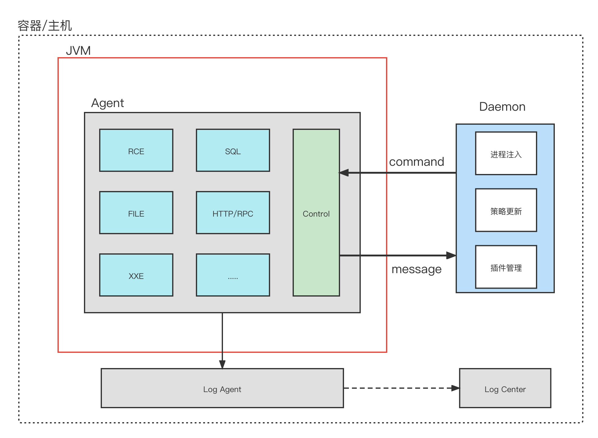

# 架构设计

### 先来说下JRASP架构：

+ 与其他rasp不同的是，jrasp除了有agent有单独的守护进程。

+ 安全插件模块化。每种模块解决一类安全漏洞，并且模块可以做到热升级；

（上图仅包含部署在服务器上的agent部分，不包括管理端等）

### 日志传输方式优化：

v1.1.1版本以下，daemon、agent、module的日志输出到磁盘文件，再由 filebeat 上报到kafka或者server管理端，该方案适用于基础设施较为完善场景。

v1.1.2 版本将优化为daemon守护进程自行上报，降低对基础设施的依赖，部署更加容易。

