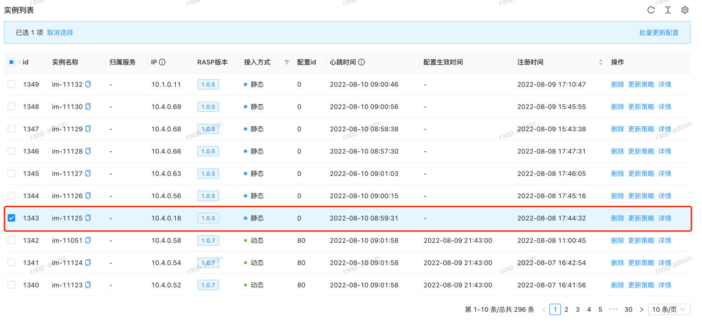
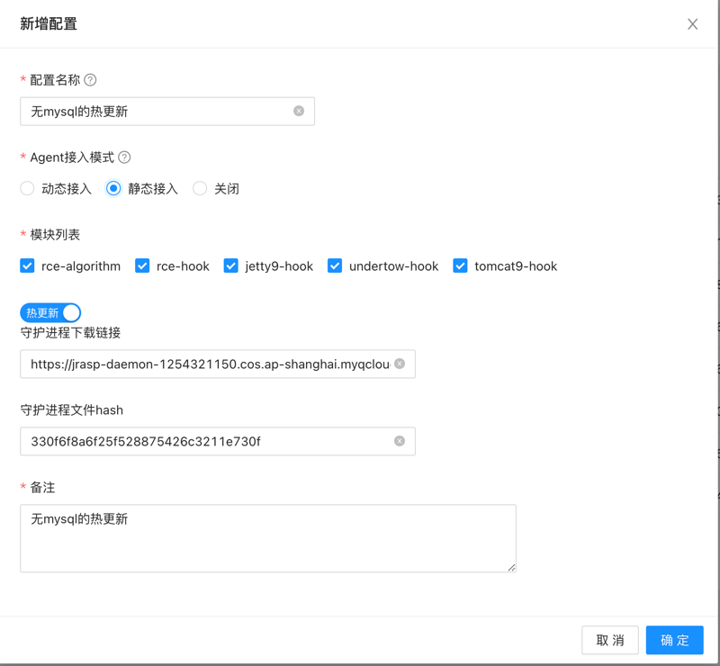
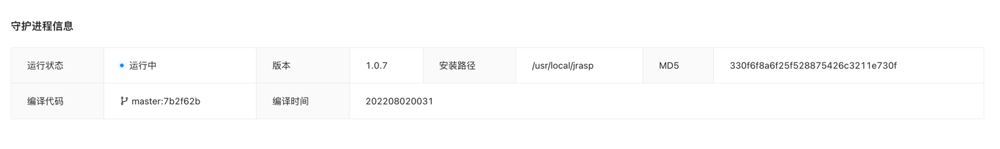

# 热升级

## 守护进程热升级

jrasp-daemon 是由`GoLang`构建，管理端配置热更新可执行文件，下发给jrasp-daemon即可。

实现原理：旧版本jrasp-daemon下载新版本的可执行文件，并重命名，然后旧版本进程的退出，进程退出之后，会被**守护进程**自动拉起来，从而实现升级。

+ 文件下载
```java
// UpdateDaemonFile 更新守护进程
func (this *Update) UpdateDaemonFile() {
	// 配置中可执行文件hash不为空，并且与env中可执行文件hash不相同
	if this.cfg.BinFileHash != "" && this.cfg.BinFileHash != this.env.BinFileHash {
		newFilePath := filepath.Join(this.env.InstallDir, "bin", "jrasp-daemon.tmp")
		err := this.DownLoad(this.cfg.BinFileUrl, newFilePath)
		if err != nil {
			zlog.Errorf(defs.DOWNLOAD, "download  jrasp-daemon file", "err:%v,down load url:%s", err, this.cfg.BinFileUrl)
			return
		}
		newHash, err := utils.GetFileMd5(newFilePath)
		if err != nil {
			zlog.Errorf(defs.DOWNLOAD, "download  jrasp-daemon file", "get file hash err:%v", err)
			return
		}
		// 校验下载文件的hash
		if newHash == this.cfg.BinFileHash {
			this.replace()
		} else {
			zlog.Errorf(defs.DOWNLOAD, "[BUG]check new file hash err", "newFileHash:%s,configHash:%s", newHash, this.cfg.BinFileHash)
			err := os.Remove(newFilePath)
			if err != nil {
				zlog.Errorf(defs.DOWNLOAD, "[BUG]delete broken file err", "newFileHash:%s", newHash)
				return
			}
		}
	} else {
		zlog.Infof(defs.DOWNLOAD, "no need to update jrasp-daemon",
			"config.binFileHash:%s,disk.binFileHash:%s", this.cfg.BinFileHash, this.env.BinFileHash)
	}
}
```

+ 可执行文件替换与进程退出
```java
// replace 文件rename
func (this *Update) replace() {
	// 增加可执行权限
	err := os.Chmod("jrasp-daemon.tmp", 0700)
	if err != nil {
		zlog.Infof(defs.DOWNLOAD, "chmod +x jrasp-demon.tmp", "err:%v", err)
	}
	err = os.Rename("jrasp-daemon.tmp", "jrasp-daemon")
	if err == nil {
		zlog.Infof(defs.DOWNLOAD, "update jrasp-daemon file success", "rename jrasp-daemon file success,daemon process will exit...")
		// 再次check
		success, _ := utils.PathExists("jrasp-daemon")
		if success {
			os.Exit(0) // 进程退出
		}
	} else {
		zlog.Errorf(defs.DOWNLOAD, "[BUG]rename jrasp-daemon file error", "jrasp-daemon file will delete")
		_ = os.Remove("jrasp-daemon.tmp")
	}
}
```

## 热升级演示

### 升级背景
红色方框中的实例中 RASP版本是`1.0.5`,该版本中存在几处bug，现在需要将其升级到最新版本`1.0.7`



### 升级前
守护进程详情：


建立更新配置并下发到实例上：



### 升级后
守护进程的版本已经更新到`1.0.7`





全过程无需登陆实例执行任何更新操作，大大节省运维时间。
