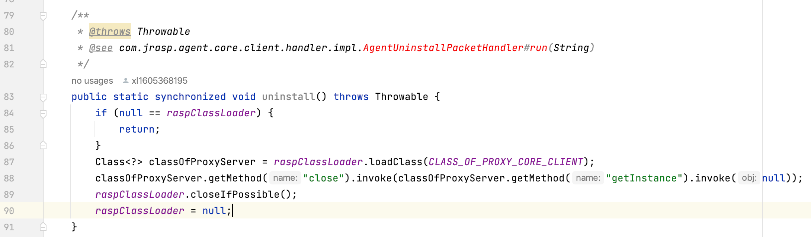
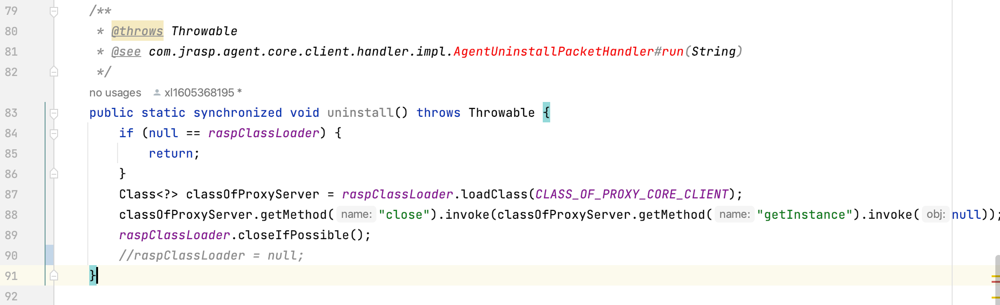
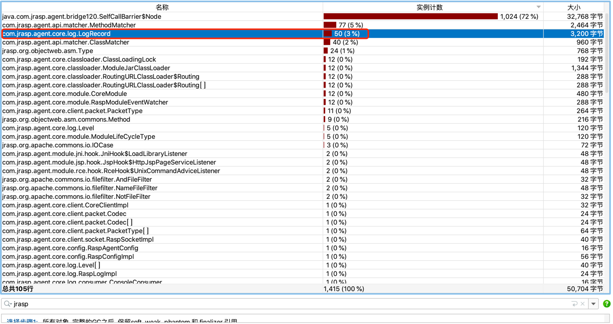
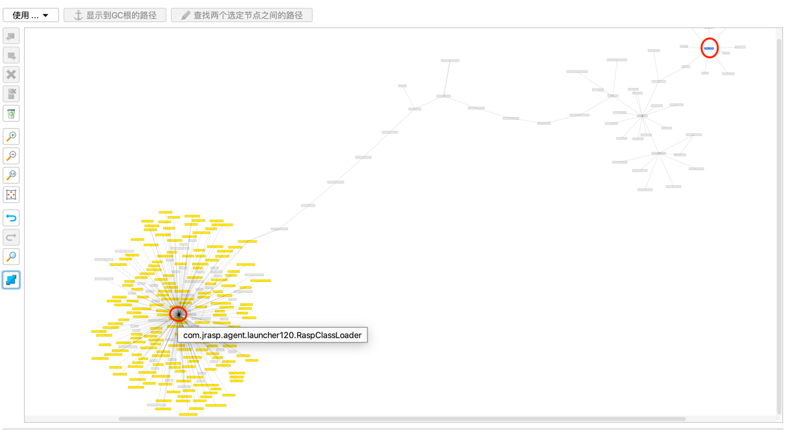
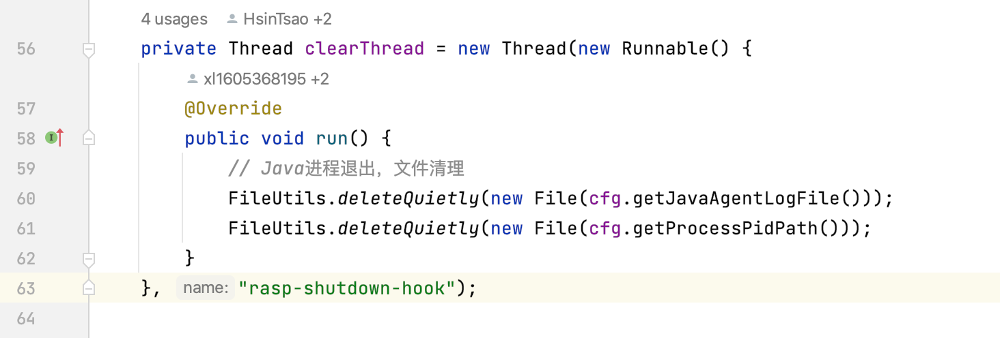
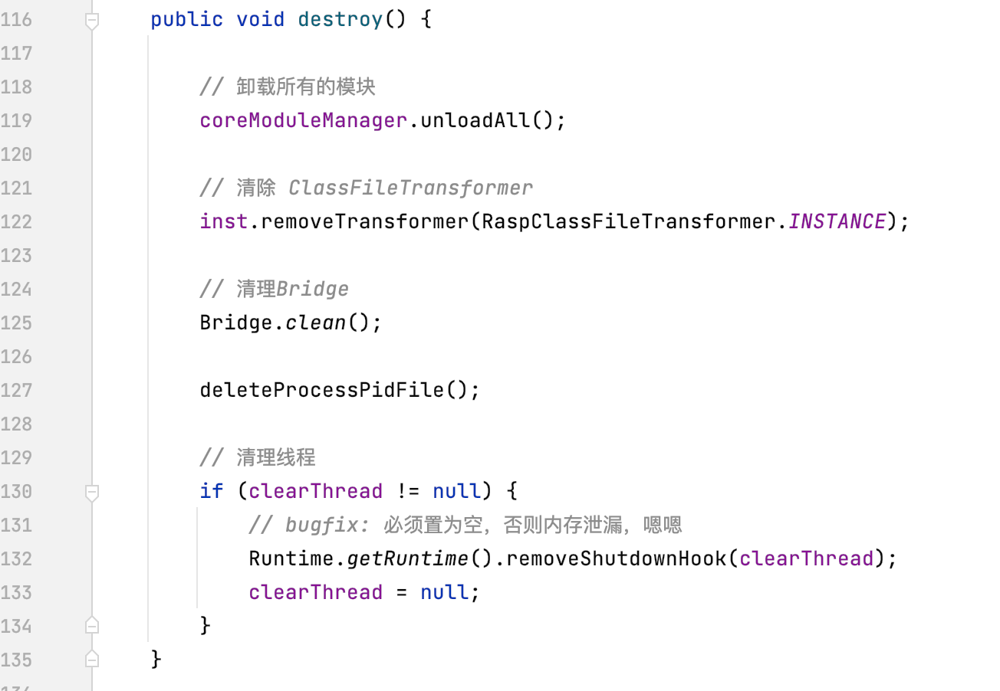
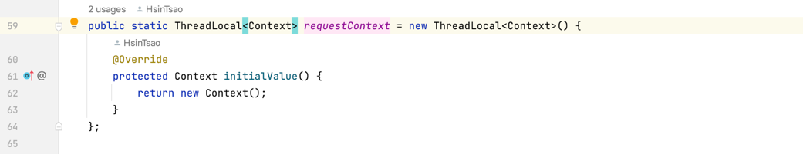
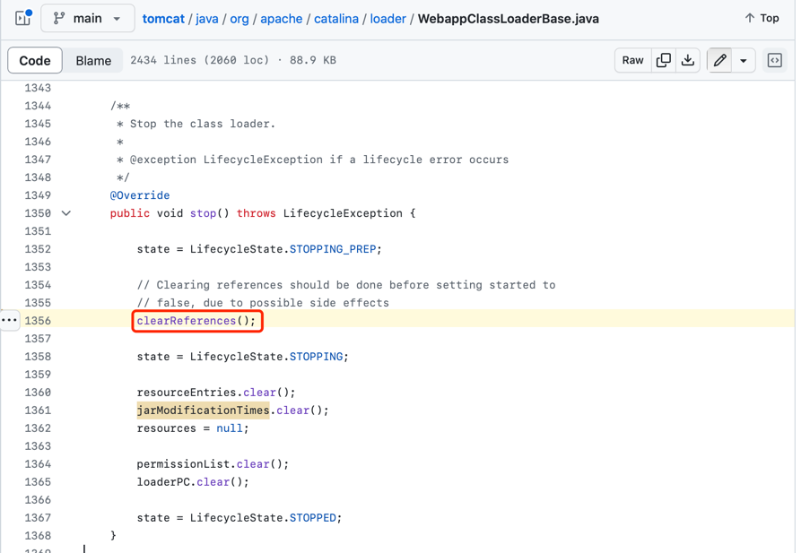
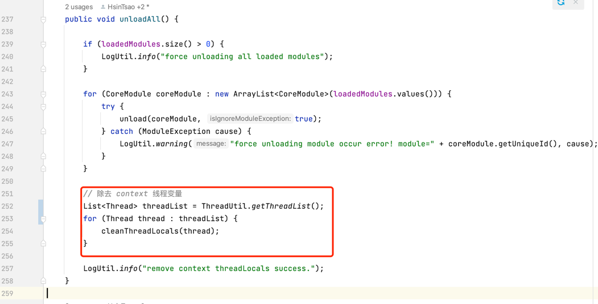
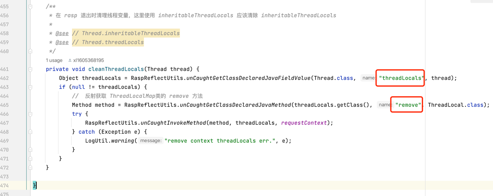

# JRASP内存泄漏检测与清除

热加载与卸载已经成为RASP的标配，而涉及到插件或者脚本的卸载问题，却少有技术文档提及，
主要原因是RASP开发人员更多的偏向安全，即使是经验丰富的Java工程师，遇到内存泄露问题，也会感到棘手。

类卸载的条件十分苛刻，要同时满足下面的三个条件：
+ 类所有的实例对象已经被回收;
+ 加载该类的Classloder已经被回收;
+ 该类对应的java.lang.Class对象没有任何对方被引用;

## 1. Class对象引用置空

一般的，无需关心class对象的引用关系，但是有些场景（如反射场景）会缓存类的Class对象，使得class对象的引用存在，导致JRASP无法卸载。

## 2. 类加载器置空

以JDK8为例子，Java虚拟机自带的类加载器有BootstrapClassLoader、ExtensionClassLoader和SystemClassLoader，
这些类加载器在JVM整个生命周期中都不会被置为空，因此它们加载的类也不会被卸载。

而用户自定义的类加载器，可以在使用完成之后将加载器的对象置空，从而满足类卸载的三个条件之一。

以JRASP代码为例子，执行卸载关闭操作之后，将自定义类加载器置空。


如果自定义类加载器没有正确的置空，JRASP将不会被完全的清理，从而引发内存泄漏。
现在我们做一个测试，将上面代码截图的第90行的`raspClassLoader = null;`注释掉（即类加载器不置空)


打包编译后加载JRASP后再执行卸载操作，主动Full GC`jmap -histo:live 50730 | grep com.jrasp.agent.core`，结果如下所示：
```java
 206:            50           3200  com.jrasp.agent.core.log.LogRecord
 307:            12           1344  com.jrasp.agent.core.classloader.ModuleJarClassLoader
 460:            12            480  com.jrasp.agent.core.module.CoreModule
 542:            12            288  [Lcom.jrasp.agent.core.classloader.RoutingURLClassLoader$Routing;
 548:            12            288  com.jrasp.agent.core.classloader.RoutingURLClassLoader$Routing
 549:            12            288  com.jrasp.agent.core.module.RaspModuleEventWatcher
 566:            11            264  com.jrasp.agent.core.client.packet.PacketType
 645:            12            192  com.jrasp.agent.core.classloader.ClassLoadingLock
 783:             5            120  com.jrasp.agent.core.log.Level
 784:             5            120  com.jrasp.agent.core.module.ModuleLifeCycleType
1064:             1             64  [Lcom.jrasp.agent.core.client.packet.PacketType;
1171:             1             56  com.jrasp.agent.core.config.RaspConfigImpl
1394:             1             40  [Lcom.jrasp.agent.core.log.Level;
1395:             1             40  [Lcom.jrasp.agent.core.module.ModuleLifeCycleType;
1416:             1             40  com.jrasp.agent.core.client.socket.RaspSocketImpl
1576:             1             32  com.jrasp.agent.core.client.CoreClientImpl
1840:             1             24  [Lcom.jrasp.agent.core.client.packet.Codec;
1893:             1             24  com.jrasp.agent.core.client.packet.Codec
1894:             1             24  com.jrasp.agent.core.log.RaspLogImpl
1895:             1             24  com.jrasp.agent.core.log.consumer.FileConsumer
1896:             1             24  com.jrasp.agent.core.log.consumer.RemoteConsumer
2321:             1             16  com.jrasp.agent.core.config.RaspAgentConfig
2322:             1             16  com.jrasp.agent.core.log.consumer.ConsoleConsumer
2323:             1             16  com.jrasp.agent.core.module.RaspCoreModuleManager$1
2324:             1             16  com.jrasp.agent.core.transformer.RaspClassFileTransformer
2325:             1             16  com.jrasp.agent.core.transformer.RaspListenerHandler
```
在Full GC之后，JRASP实例个数不为空，存在内存泄漏。

使用性能诊断（jprofile）工具，查看JRASP的对象：



查看其中一个对象的引用关系，如下所示：



从上图的引用关系可以明显看出，存在一条引用链路，链路从`RaspClassloader`开始指向`LogRecord` （上图中两个红色圈的之间的灰色线）
(黄色为class对象，红色为GC Roots)

内存泄漏的原因：classloader没有置为空，导致内存泄漏。

## 3. 对象置空和资源关闭

以JRASP为例子这里包括线程池关闭、自定义线程、定时器停止、shutdownHook移除、ClassFileTransformer移除和threadlocal线程变量清除等.

### 3.1 定时器停止

完全停止`java.lang.timer`，需要将定时器线程停止，并将任务执行队列清空。

### 3.2 shutdownHook移除

在Java进程关闭之前，能够即时的清理rasp占用的磁盘等资源，shutdownHook可以执行指定的操作。


如果主动关闭rasp，没有清理shutdownHook，将会导致内存泄漏。


### 3.3 线程池关闭

如果RASP使用到了线程池，在卸载时需要关闭。即使关闭了线程池，由于jvm线程池重写了`finalize`方法，一次FullGC依然无法清除残留的对象。
JRASP1.2.x版本已经把线程池替换为多个`java.lang.timer`，卸载时非常清爽干净。

### 3.4 线程变量的清除

在RASP中，使用线程变量threadlocal关联请求上下文与具体的hook类，来辅助检测功能。


在RASP卸载时，需要将线程thread中缓存的threadlocal对象。

在介绍JRASP实现方案之前，先来看下tomcat是如何实现热卸载的和内存泄漏检测的。

#### 3.4.1 tomcat资源清除与内存泄漏检测

tomcat在卸载war包时，调用war的类加载器`WebappClassLoaderBase`对象的stop方法完成资源的关闭与清理操作。


具体的引用清除实现来在`clearReferences`中，主要有：注销JDBC驱动、关闭应用创建的线程、检查线程变量的内存泄漏等，关闭连接和线程的操作容易实现，本节主要针对线程变量的内存泄漏清理与检测。

+ 线程变量泄漏检测

在线程Thread对象中使用两个字段保存该线程使用的`threadlocal`对象：
```java
public class Thread implements Runnable {
    
    /* ThreadLocal values pertaining to this thread. This map is maintained
     * by the ThreadLocal class. */
    ThreadLocal.ThreadLocalMap threadLocals = null;

    /*
     * InheritableThreadLocal values pertaining to this thread. This map is
     * maintained by the InheritableThreadLocal class.
     */
    ThreadLocal.ThreadLocalMap inheritableThreadLocals = null;
    
    // 其他代码省略...
}   
```
threadLocals的类型是`ThreadLocalMap`，ThreadLocalMap中用数组table保存threadlocal变量的key、value。
因此最终我们需要清理的是这个table里面的Entry。
```java
static class ThreadLocalMap {
    
    static class Entry extends WeakReference<ThreadLocal<?>> {
        Object value;
        Entry(ThreadLocal<?> k, Object v) {
            super(k);
            value = v;
        }
    }
    
    // 保存threadlocal变量的key、value
    private Entry[] table;
}    
```

tomcat中线程变量的内存泄漏检测代码在`checkThreadLocalsForLeaks`中。
```java
private void checkThreadLocalsForLeaks() {
     // 获取 jvm 全部线程
     Thread[] threads = getThreads();
     try {
         // 反射获取threadLocals、inheritableThreadLocals
         Field threadLocalsField = Thread.class.getDeclaredField("threadLocals");
         threadLocalsField.setAccessible(true);
         Field inheritableThreadLocalsField = Thread.class.getDeclaredField("inheritableThreadLocals");
         inheritableThreadLocalsField.setAccessible(true);
         
         // 反射获取ThreadLocalMap的table字段
         Class<?> tlmClass = Class.forName("java.lang.ThreadLocal$ThreadLocalMap");
         Field tableField = tlmClass.getDeclaredField("table");
         tableField.setAccessible(true);
         
         // 反射获取expungeStaleEntries方法，该方法的作用是清除所有过期的entry
         Method expungeStaleEntriesMethod = tlmClass.getDeclaredMethod("expungeStaleEntries");
         expungeStaleEntriesMethod.setAccessible(true);
         
         //　遍历所有线程，清除引用
         for (Thread thread : threads) {
             Object threadLocalMap;
             if (thread != null) {

                 // 清除 threadLocalsField 字段引用的对象
                 threadLocalMap = threadLocalsField.get(thread);
                 if (null != threadLocalMap) {
                     expungeStaleEntriesMethod.invoke(threadLocalMap);
                     // 检测已经被完全清楚干净，如果发现entry的key或者value对象的类是由当前类的war包加载器加载
                     // 说明依然存在内存泄漏，需要进行修复。
                     checkThreadLocalMapForLeaks(threadLocalMap, tableField);
                 }

                 // 清除 inheritableThreadLocalsField 字段引用的对象
                 threadLocalMap = inheritableThreadLocalsField.get(thread);
                 if (null != threadLocalMap) {
                     expungeStaleEntriesMethod.invoke(threadLocalMap);
                     checkThreadLocalMapForLeaks(threadLocalMap, tableField);
                 }
             }
         }
     } catch (InaccessibleObjectException e) {
         // Must be running on without the necessary command line options.
         log.warn(sm.getString("webappClassLoader.addExportsThreadLocal", getCurrentModuleName()));
     } catch (Throwable t) {
         ExceptionUtils.handleThrowable(t);
         log.warn(sm.getString("webappClassLoader.checkThreadLocalsForLeaksFail", getContextName()), t);
     }
 }
```

#### 3.4.2 JRASP线程清除方案

一般的在使用完线程变量之后，要及时的调用`threadlocal.remove()` 将线程变量移除。
但是对于RASP来说，业务线程池线程复用机制，并且无法确定什么时候终止，也就无法在任务执行完成之后清除。

JRASP采用类使用tomcat线程变量内存泄漏的检测方式，即反射调用`threadlocal.remove()`方法。



cleanThreadLocals的实现：



上面的方案存在一些限制，JDK17以上禁止了跨模块的反射，上面的反射调用执行会报错，需要业务在jvm参数中增加
`--add-opens=java.base/java.lang=ALL-UNNAMED` 解除限制。


## 4. 总结

本文介绍了RASP卸载时的的一些坑，并给出了解决方案，特别是线程池的threadlocal内存泄漏，
给出了检测和卸载代码，该方案在JRASP上使用较为成熟。

