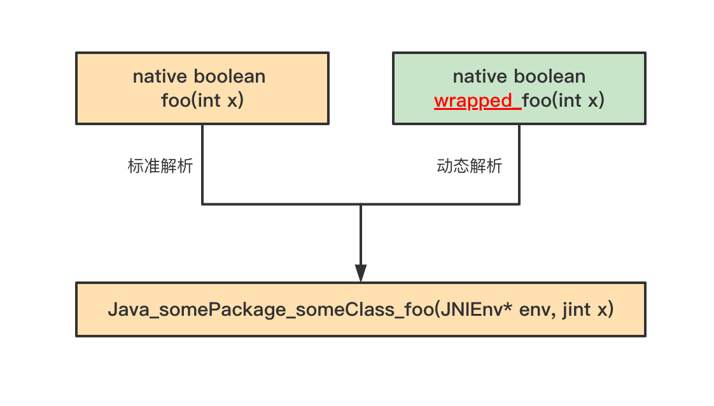

# hook native方法

## 背景

RASP实现的基本原理是修改目标方法体，将检测逻辑插入到目标方法体中。而在Java方法中有一类是`没有方法体`（如接口中的方法、抽象方法和native方法），
其中native方法是是Java层面向系统层面调用的入口。

## 原理

> java.lang.instrument.Instrumentation#setNativeMethodPrefix

setNativeMethodPrefix方法的注释

```java
    /**
     * This method modifies the failure handling of
     * native method resolution by allowing retry
     * with a prefix applied to the name.
     * When used with the
     * {@link java.lang.instrument.ClassFileTransformer ClassFileTransformer},
     * it enables native methods to be
     * instrumented.
     * <p>
     * Since native methods cannot be directly instrumented
     * (they have no bytecodes), they must be wrapped with
     * a non-native method which can be instrumented.
     * For example, if we had:
     * <pre>
     *   native boolean foo(int x);</pre>
     * <p>
     * We could transform the class file (with the
     * ClassFileTransformer during the initial definition
     * of the class) so that this becomes:
     * <pre>
     *   boolean foo(int x) {
     *     <i>... record entry to foo ...</i>
     *     return wrapped_foo(x);
     *   }
     *
     *   native boolean wrapped_foo(int x);</pre>
     * <p>
     * Where <code>foo</code> becomes a wrapper for the actual native
     * method with the appended prefix "wrapped_".  Note that
     * "wrapped_" would be a poor choice of prefix since it
     * might conceivably form the name of an existing method
     * thus something like "$$$MyAgentWrapped$$$_" would be
     * better but would make these examples less readable.
     * <p>
     * The wrapper will allow data to be collected on the native
     * method call, but now the problem becomes linking up the
     * wrapped method with the native implementation.
     * That is, the method <code>wrapped_foo</code> needs to be
     * resolved to the native implementation of <code>foo</code>,
     * which might be:
     * <pre>
     *   Java_somePackage_someClass_foo(JNIEnv* env, jint x)</pre>
     * <p>
     * This function allows the prefix to be specified and the
     * proper resolution to occur.
     * Specifically, when the standard resolution fails, the
     * resolution is retried taking the prefix into consideration.
     * There are two ways that resolution occurs, explicit
     * resolution with the JNI function <code>RegisterNatives</code>
     * and the normal automatic resolution.  For
     * <code>RegisterNatives</code>, the JVM will attempt this
     * association:
     * <pre>{@code
     *   method(foo) -> nativeImplementation(foo)
     * }</pre>
     * <p>
     * When this fails, the resolution will be retried with
     * the specified prefix prepended to the method name,
     * yielding the correct resolution:
     * <pre>{@code
     *   method(wrapped_foo) -> nativeImplementation(foo)
     * }</pre>
     * <p>
     * For automatic resolution, the JVM will attempt:
     * <pre>{@code
     *   method(wrapped_foo) -> nativeImplementation(wrapped_foo)
     * }</pre>
     * <p>
     * When this fails, the resolution will be retried with
     * the specified prefix deleted from the implementation name,
     * yielding the correct resolution:
     * <pre>{@code
     *   method(wrapped_foo) -> nativeImplementation(foo)
     * }</pre>
     * <p>
     * Note that since the prefix is only used when standard
     * resolution fails, native methods can be wrapped selectively.
     * <p>
     * Since each <code>ClassFileTransformer</code>
     * can do its own transformation of the bytecodes, more
     * than one layer of wrappers may be applied. Thus each
     * transformer needs its own prefix.  Since transformations
     * are applied in order, the prefixes, if applied, will
     * be applied in the same order
     * (see {@link #addTransformer(ClassFileTransformer,boolean) addTransformer}).
     * Thus if three transformers applied
     * wrappers, <code>foo</code> might become
     * <code>$trans3_$trans2_$trans1_foo</code>.  But if, say,
     * the second transformer did not apply a wrapper to
     * <code>foo</code> it would be just
     * <code>$trans3_$trans1_foo</code>.  To be able to
     * efficiently determine the sequence of prefixes,
     * an intermediate prefix is only applied if its non-native
     * wrapper exists.  Thus, in the last example, even though
     * <code>$trans1_foo</code> is not a native method, the
     * <code>$trans1_</code> prefix is applied since
     * <code>$trans1_foo</code> exists.
     *
     * @param   transformer
     *          The ClassFileTransformer which wraps using this prefix.
     * @param   prefix
     *          The prefix to apply to wrapped native methods when
     *          retrying a failed native method resolution. If prefix
     *          is either <code>null</code> or the empty string, then
     *          failed native method resolutions are not retried for
     *          this transformer.
     * @throws java.lang.NullPointerException if passed a <code>null</code> transformer.
     * @throws java.lang.UnsupportedOperationException if the current configuration of
     *           the JVM does not allow setting a native method prefix
     *           ({@link #isNativeMethodPrefixSupported} is false).
     * @throws java.lang.IllegalArgumentException if the transformer is not registered
     *           (see {@link #addTransformer(ClassFileTransformer,boolean) addTransformer}).
     *
     * @since 1.6
     */
    void
    setNativeMethodPrefix(ClassFileTransformer transformer, String prefix);
```

## 细节

### 开启native函数的prefix功能
native函数的prefix功能`默认关闭`，需要在agent包之中的`MANIFEST.MF`文件中设置
`Can-Set-Native-Method-Prefix: true`

示例如下：

```java
Manifest-Version: 1.0
Premain-Class: com.jrasp.example.agent.Agent
Agent-Class: com.jrasp.example.agent.Agent
Can-Redefine-Classes: true
Can-Retransform-Classes: true
Class-Path: asm-9.2.jar asm-commons-9.2.jar asm-tree-9.2.jar asm-analy
 sis-9.2.jar asm-util-9.2.jar commons-io-2.11.0.jar
Can-Set-Native-Method-Prefix: true
Build-Jdk-Spec: 1.8
Created-By: Maven JAR Plugin 3.2.2

```

### Java 方法与 native 方法的映射关系

#### 标准解析
先来看命令执行的native方法和他的实现。
> java.lang.UNIXProcess#forkAndExec
```java
private native int forkAndExec(int mode, byte[] helperpath,
                                   byte[] prog,
                                   byte[] argBlock, int argc,
                                   byte[] envBlock, int envc,
                                   byte[] dir,
                                   int[] fds,
                                   boolean redirectErrorStream)
        throws IOException;
```
对应的native方法(hotspot)

> jdk/src/solaris/native/java/lang/UNIXProcess_md.c
```java
JNIEXPORT jint JNICALL
Java_java_lang_UNIXProcess_forkAndExec(JNIEnv *env,
                                       jobject process,
                                       jint mode,
                                       jbyteArray helperpath,
                                       jbyteArray prog,
                                       jbyteArray argBlock, jint argc,
                                       jbyteArray envBlock, jint envc,
                                       jbyteArray dir,
                                       jintArray std_fds,
                                       jboolean redirectErrorStream){
    //...（不是本文重点，省略）
}
```
可以看出：native方法的名称是由Java类的`包名称`和`方法名称`组成。 这个规则这称之为：`standard resolution（标准解析）`

#### 动态解析

如果给jvm增加一个ClassTransformer并设置native prefix，jvm将使用`动态解析`方式。

+ 假设我们有这样一个 native 方法,标准解析下对应的native 方法实现
```java
native boolean foo(int x);  ====> Java_somePackage_someClass_foo(JNIEnv* env, jint x);
```

+ 给jvm增加一个ClassTransformer并设置native prefix 为`wrapped_`,这个类在转换之后。

方法的解析规则将变成:
```java
native boolean wrapped_foo(int x);  ====> Java_somePackage_someClass_foo(JNIEnv* env, jint x);
```
(请注意 prefix 在native函数名中出现的位置！)



一旦可以找到对应的native实现，那么调用这个函数，整个解析过程就结束了；

如果没有找到，那么虚拟机将会做依次进行下面的解析工作：

1）method(foo) -> nativeImplementation(foo)

增加method的prefix，继续：

2）method(wrapped_foo) -> nativeImplementation(foo)

增加 nativeImplementation的prefix，继续：

3）method(wrapped_foo) -> nativeImplementation(wrapped_foo)

去掉nativeImplementation的prefix，继续：

4）method(wrapped_foo) -> nativeImplementation(foo)

如果找到上面的其中一个对应关系，则执行之。否则，因为没有任何一个合适的解析方式，于是宣告这个过程失败。

+ 有多个 transformer场景

虚拟机是按 transformer 被加入到的 Instrumentation 之中的次序去解析的（即addTransformer）。

假设有三个 transformer 要被加入进来，他们的次序和相对应的 prefix 分别为：transformer1 和“prefix1_”，transformer2 和 “prefix2_”，transformer3 和 “prefix3_”。
虚拟机做的解析规则为 :
```java
native boolean prefix1_prefix2_prefix3_foo(int x);  ====> Java_somePackage_someClass_foo(JNIEnv* env, jint x);
```

## 实现
（全部代码，github使用不方便）
> Agent
```java
package com.jrasp.example.agent;

import java.lang.instrument.Instrumentation;
import java.text.SimpleDateFormat;
import java.util.Date;

public class Agent {

    public static void premain(String args, Instrumentation inst) {
        main(args, inst);
    }

    public static void agentmain(String args, Instrumentation inst) {
        main(args, inst);
    }

    public static void main(String args, Instrumentation inst) {
        System.out.println(String.format("%s  INFO [rasp] %s ",
                new SimpleDateFormat("yyyy-MM-dd HH:mm:ss.sss").format(new Date()), "enter agent"));
        RaspClassFileTransformer raspClassFileTransformer = new RaspClassFileTransformer(inst);
        inst.addTransformer(raspClassFileTransformer);
    }
}

```

> RaspClassVisitor

```java
package com.jrasp.example.agent;

import org.objectweb.asm.*;
import org.objectweb.asm.commons.AdviceAdapter;
import org.objectweb.asm.commons.JSRInlinerAdapter;

import java.lang.instrument.Instrumentation;

public class RaspClassVisitor extends ClassVisitor {

    private final static String NATIVE_PREFIX = "RASP";

    private RaspMethod method = null;

    private final String targetClassInternalName;

    private final Instrumentation inst;

    private RaspClassFileTransformer raspClassFileTransformer;

    public RaspClassVisitor(final int api, final ClassVisitor cv,
                            String targetClassInternalName, Instrumentation inst,
                            RaspClassFileTransformer raspClassFileTransformer) {
        super(api, cv);
        this.targetClassInternalName = targetClassInternalName;
        this.inst = inst;
        this.raspClassFileTransformer = raspClassFileTransformer;
    }
    
    @Override
    public MethodVisitor visitMethod(final int access, final String name, final String desc, final String signature, final String[] exceptions) {
        if ("forkAndExec".equals(name)) {
            if (inst.isNativeMethodPrefixSupported()) {
                inst.setNativeMethodPrefix(raspClassFileTransformer, NATIVE_PREFIX);
            } else {
                throw new UnsupportedOperationException("Native Method Prefix Unspported");
            }
            int newAccess = access & ~Opcodes.ACC_NATIVE;
            method = new RaspMethod(access, NATIVE_PREFIX + name, desc);
            final MethodVisitor mv = super.visitMethod(newAccess, name, desc, signature, exceptions);
            return new AdviceAdapter(api, new JSRInlinerAdapter(mv, newAccess, name, desc, signature, exceptions), newAccess, name, desc) {
                @Override
                public void visitEnd() {
                    loadThis();
                    loadArgs();
                    mv.visitMethodInsn(Opcodes.INVOKESPECIAL, targetClassInternalName, method.getName(), method.getDescriptor(), false);
                    returnValue();
                    super.visitEnd();
                }
            };
        }
        return super.visitMethod(access, name, desc, signature, exceptions);
    }

    @Override
    public void visitEnd() {
        if (method != null) {
            int newAccess = (Opcodes.ACC_PRIVATE | Opcodes.ACC_NATIVE | Opcodes.ACC_FINAL);
            MethodVisitor mv = cv.visitMethod(newAccess, method.getName(), method.getDescriptor(), null, null);
            mv.visitEnd();
        }
        super.visitEnd();
    }

}
```

> RaspClassFileTransformer
```java
package com.jrasp.example.agent;

import java.io.File;
import java.io.IOException;
import java.lang.instrument.ClassFileTransformer;
import java.lang.instrument.IllegalClassFormatException;
import java.lang.instrument.Instrumentation;
import java.security.ProtectionDomain;

import static org.objectweb.asm.ClassReader.EXPAND_FRAMES;
import static org.objectweb.asm.ClassWriter.COMPUTE_FRAMES;
import static org.objectweb.asm.ClassWriter.COMPUTE_MAXS;
import static org.objectweb.asm.Opcodes.ASM9;

public class RaspClassFileTransformer implements ClassFileTransformer {

    private final Instrumentation inst;

    public RaspClassFileTransformer(Instrumentation inst) {
        this.inst = inst;
    }

    @Override
    public byte[] transform(ClassLoader loader, String className,
                            Class<?> classBeingRedefined,
                            ProtectionDomain protectionDomain,
                            byte[] classfileBuffer) throws IllegalClassFormatException {
        try {
            if ("java/lang/UNIXProcess".equals(className) || "java.lang.ProcessImpl".equals(className)) {
                final ClassReader cr = new ClassReader(classfileBuffer);
                final ClassWriter cw = new ClassWriter(cr, COMPUTE_FRAMES | COMPUTE_MAXS);
                cr.accept(new RaspClassVisitor(ASM9, cw, cr.getClassName(), inst, this), EXPAND_FRAMES);
                return dumpClassIfNecessary(cr.getClassName(), cw.toByteArray());
            }
        } catch (Exception e) {
            e.printStackTrace();
        }

        return null;
    }

    private static byte[] dumpClassIfNecessary(String className, byte[] data) {
        final File dumpClassFile = new File("./rasp-class-dump/" + className + ".class");
        final File classPath = new File(dumpClassFile.getParent());
        if (!classPath.mkdirs()
                && !classPath.exists()) {
            return data;
        }
        try {
            FileUtils.writeByteArrayToFile(dumpClassFile, data);
        } catch (IOException e) {
            e.printStackTrace();
        }
        return data;
    }

}
```
> RaspMethod
```java
package com.jrasp.example.agent;

import org.objectweb.asm.commons.Method;

public class RaspMethod extends Method {

    public int access;

    public RaspMethod(int access, String name, String descriptor) {
        super(name, descriptor);
        this.access = access;
    }
}
```
> POM.xml
```java
<?xml version="1.0" encoding="UTF-8"?>
<project xmlns="http://maven.apache.org/POM/4.0.0"
         xmlns:xsi="http://www.w3.org/2001/XMLSchema-instance"
         xsi:schemaLocation="http://maven.apache.org/POM/4.0.0 http://maven.apache.org/xsd/maven-4.0.0.xsd">
    <modelVersion>4.0.0</modelVersion>

    <groupId>org.example</groupId>
    <artifactId>java-agent</artifactId>
    <version>1.0-SNAPSHOT</version>

    <properties>
        <shade-prefix>rasp</shade-prefix>
    </properties>

    <dependencies>
        <dependency>
            <groupId>org.ow2.asm</groupId>
            <artifactId>asm</artifactId>
            <version>9.2</version>
        </dependency>
        <dependency>
            <groupId>org.ow2.asm</groupId>
            <artifactId>asm-commons</artifactId>
            <version>9.2</version>
        </dependency>
        <dependency>
            <groupId>org.ow2.asm</groupId>
            <artifactId>asm-util</artifactId>
            <version>9.2</version>
        </dependency>
        <dependency>
            <groupId>commons-io</groupId>
            <artifactId>commons-io</artifactId>
            <version>2.11.0</version>
        </dependency>
    </dependencies>

    <build>
        <plugins>
            <plugin>
                <groupId>org.apache.maven.plugins</groupId>
                <artifactId>maven-compiler-plugin</artifactId>
                <version>3.8.0</version>
                <configuration>
                    <source>1.6</source>
                    <target>1.6</target>
                    <encoding>UTF-8</encoding>
                    <showDeprecation>true</showDeprecation>
                </configuration>
            </plugin>
            <plugin>
                <groupId>org.apache.maven.plugins</groupId>
                <artifactId>maven-jar-plugin</artifactId>
                <version>3.2.2</version>
                <configuration>
                    <archive>
                        <manifest>
                            <addClasspath>true</addClasspath>
                        </manifest>
                        <manifestEntries>
                            <Premain-Class>com.jrasp.example.agent.Agent</Premain-Class>
                            <Agent-Class>com.jrasp.example.agent.Agent</Agent-Class>
                            <Can-Redefine-Classes>true</Can-Redefine-Classes>
                            <Can-Retransform-Classes>true</Can-Retransform-Classes>
                            <Can-Set-Native-Method-Prefix>true</Can-Set-Native-Method-Prefix>
                        </manifestEntries>
                    </archive>
                </configuration>
            </plugin>
            <plugin>
                <groupId>org.apache.maven.plugins</groupId>
                <artifactId>maven-shade-plugin</artifactId>
                <version>3.1.0</version>
                <executions>
                    <execution>
                        <phase>package</phase>
                        <goals>
                            <goal>shade</goal>
                        </goals>
                        <configuration>
                            <relocations>
                                <relocation>
                                    <pattern>org.objectweb.asm</pattern>
                                    <shadedPattern>${shade-prefix}.org.objectweb.asm</shadedPattern>
                                </relocation>
                                <relocation>
                                    <pattern>org.apache.commons.io</pattern>
                                    <shadedPattern>${shade-prefix}.org.apache.commons.io</shadedPattern>
                                </relocation>
                            </relocations>
                            <filters>
                                <filter>
                                    <artifact>*:*</artifact>
                                    <excludes>
                                        <exclude>META-INF/*.SF</exclude>
                                        <exclude>META-INF/*.DSA</exclude>
                                        <exclude>META-INF/*.RSA</exclude>
                                    </excludes>
                                </filter>
                            </filters>
                        </configuration>
                    </execution>
                </executions>
            </plugin>
        </plugins>
    </build>
</project>
```

## 实践
以 `java.lang.UNIXProcess`,`java.lang.ProcessImpl`的 `forkAndExec`为例子说明。[该方法作用请参考](https://www.jrasp.com/guide/hook/rce.html)

原始字节码：
>java.lang.UNIXProcess#forkAndExec
```java
private final native int forkAndExec(int var1, byte[] var2, byte[] var3, byte[] var4, int var5, byte[] var6, int var7, byte[] var8, int[] var9, boolean var10);
```

修改后的字节码：

>java.lang.UNIXProcess#forkAndExec
```java
private int forkAndExec(int var1, byte[] var2, byte[] var3, byte[] var4, int var5, byte[] var6, int var7, byte[] var8, int[] var9, boolean var10) throws IOException {
    return this.RASPforkAndExec(var1, var2, var3, var4, var5, var6, var7, var8, var9, var10);
}
```

>java.lang.UNIXProcess#RASPforkAndExec
```java
private final native int RASPforkAndExec(int var1, byte[] var2, byte[] var3, byte[] var4, int var5, byte[] var6, int var7, byte[] var8, int[] var9, boolean var10);
```

## 总结

+ 分析了修改native方法字节码的原理
+ 并给出一个实际的例子

