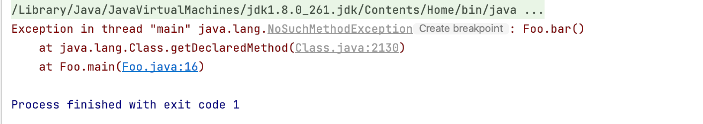
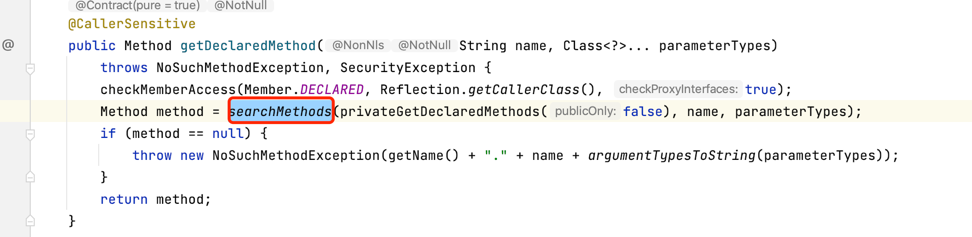
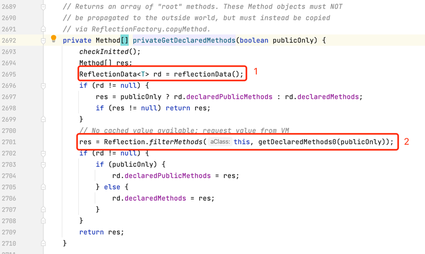
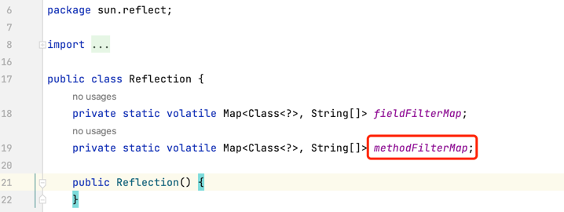
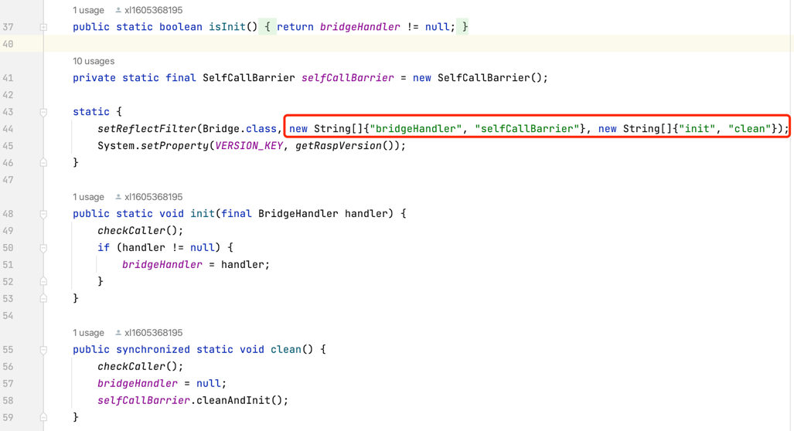
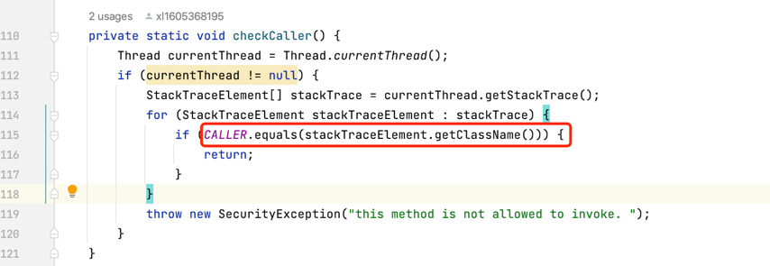
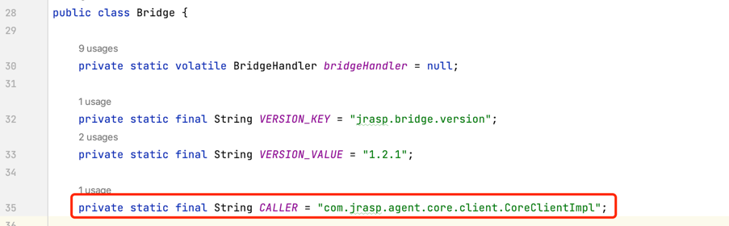

# JRASP反射加固实践

JRASP十分重视自身安全性的建设，采用了多种方式提高RASP自身的安全防护能力，包括：
+ 策略配置加密；
+ RASP自身代码与业务隔离；
+ 安全策略模块磁盘加密、运行时解密；
+ Agent与Daemon的socket通讯加密；

作为开源项目，如果熟悉JRASP的初始化和关闭流程，将存在一类重要的绕过方式：
调用RASP的关闭或者卸载开关。
具体可以参考下面的文章：
> RASP的安全攻防研究实践 https://www.cnblogs.com/wh4am1/p/16780056.html

本文主要介绍下JRASP如何防止关键方法被反射调用。 先来看下JDK 的反射机制。

## 1. JDK代码中的反射与限制

### 1.1 反射Demo
一般的我们可以通过调用class对象的`getDeclaredMethods`来获取该类的所有的方法（包含私有方法）。
下面的代码定义了一个Foo类和私有的bar方法，并使用反射获取bar方法。
```java
import java.lang.reflect.Method;

public class Foo {

    private void bar() {
    }

    public static void main(String[] args) throws Exception {
        Method method = Foo.class.getDeclaredMethod("bar");
        if (method != null) {
            System.out.println(method.getName());
        }
    }

}
// 代码输出：bar
```

如果给类Foo中加上如下的静态代码:
```java
    static {
        Reflection.registerMethodsToFilter(Foo.class, "bar");
    }
```
再次运行main，输出如下：


加上静态代码块之后，方法执行抛出了`java.lang.NoSuchMethodException`。

### 1.2 反射源码解析
在JDK中，对于一些执行权限较高的类如`sun.misc.Unsafe`，其中的`getUnsafe`方法也是无法通过反射获取。
原因是`sun.misc.Unsafe`的静态块中也有这么一行代码:
```java
static {
    Reflection.registerMethodsToFilter(Unsafe.class, new String[]{"getUnsafe"});
}
```
这个方法的作用通过方法名就可以看出来了: `注册方法到过滤器`。这个方法需要传两个参数,第一指明要过滤的Class对象,
第二个是个String数组，里面放要过滤掉的方法名称。

Reflection在sun.reflect包下,该类维护了两个Map:
```java
private static volatile Map<Class<?>, String[]> fieldFilterMap;
private static volatile Map<Class<?>, String[]> methodFilterMap;
```
以Class对象作为key值，一个保存需要过滤的属性名数组，一个保存需要过滤的方法名数组。
从上面的方法名称可以知道，在获取反射方法或者字段时，JVM根据class对象注册的方法或者字段的过滤器，将指定方法或者字段进行了排除。

下面重点分析下整个过滤的过程：

`getDeclaredMethod`源码如下，`searchMethods`使用类名称和参数列表从方法列表中查找出指定的方法。



查找方法的范围来源于`privateGetDeclaredMethods`方法返回值，其源码如下：



1处：为方法的缓存，如果已经有缓存，直接返回方法列表；

2处：如果方法的缓存为null，从JVM中获取全部的方法，并对方法进行过滤，然后将过滤的结果设置为缓存。


过滤使用了Reflection的静态字段`methodFilterMap`，该字段的定义如下：



### 1.3 一般应用

JVM提供了禁止反射指定类的方法和字段的功能，对于RASP中的关键方法字段(如关闭、初始化和状态控制等)，我们可以将其设置为禁止反射：



## 2. 方法调用者鉴权

### 2.1 @CallerSensitive
还有一类场景能够绕过`禁止方法直接反射`，即反射调用其他方法，该方法能够调用关闭的方法，即：

恶意方法--(反射调用)--> 方法A--(直接调用)--> 关键方法B 

从而达到任意调用关键方法的目的，JVM 提供了注解`@CallerSensitive`来解决反射层次问题，但是该方案存在一些限制,
`@CallerSensitive` 需要配合`Reflection.getCallerClass()` 来使用，而调用`getCallerClass`的类不能是自定义类加载加载的类。

JRASP核心逻辑全部由自定义加载器加载，@CallerSensitive注解方案不可行。

### 2.2 调用栈特征识别

JRASP对于自定义加载器加载的类中的关键方法都采用了栈特征校验：
+ 检查调用栈是否存在反射，即栈特征是否存在`java.lang.reflect.`等相关特征
+ 调用来源是否为指定的类。如下所示给出一个例子：



并将caller 定义为不可变常量.



## 3. 总结

本文给出了RASP关键方法的保护方案，使用JVM提供的过滤器来禁止直接反射调用，
对于间接反射调用的来源和栈特征做了校验， 提升RASP自身安全防护水平。


