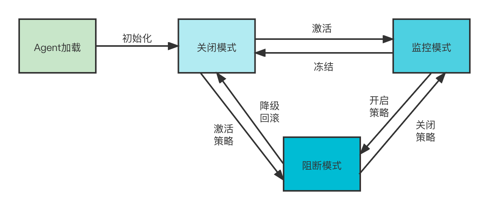
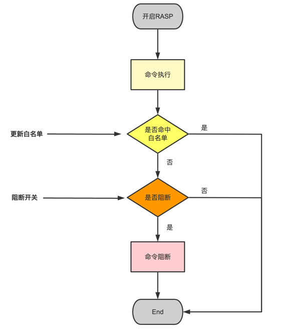

# RASP运行模式

RASP 运行模式分为三种：关闭模式、监控模式和阻断模式

## 关闭模式

既不提供监控功能也不提供阻止功能。此模式中，RASP 将暂时失去作用，所有请求都可以通过RASP。

## 监控模式

RASP程序监视应用程序中的攻击，记录日志并发出告警，但不阻止请求。

## 阻断模式

RASP阻止所有非法请求。

## 三种模式的关系


图1. RASP三种运行模式切换

+ Agent初始化后，RASP处于关闭模式，rasp-daemon收集系统负载情况后，决定是否激活监控功能；

+ 服务处于监控状态，收集业务特征（文件访问、命令执行、类加载等）；

+ 根据业务特征建立白名单，然后更新RASP白名单，开启阻断策略，进入阻断模式；

+ 阻断误操作，可以关闭阻断策略或者更新白名单；

+ 服务负载变化RASP性能下降，阻断模式先软降级；服务负载持续升高，RASP性能持续下降，关闭RASP；

## 阻断实现

以命令执行为例： 命令执行是高危操作，应该执行阻断操作。除了攻击命令，用户还会执行一些系统命令，这部分命令如果阻断了会影响业务的正常运行甚至出现较为严重的事故。
业务正常的命令执行需要加入白名单之中，意味着每个业务要维护自己的白名单。


### RASP阻断应该具备的2个能力：

* 具备开启阻断的功能

* 具备白名单功能


### 阻断流程



### 命令执行开启/关闭阻断

+ 关闭阻断
```
/jrasp.sh -p 3594 -d "rce/block?isBlock=false"
{"code":200,"data":false,"message":"更新命令执行阻断状态"}
```

+ 开启阻断
```
/jrasp.sh -p 3594 -d "rce/block?isBlock=true"
{"code":200,"data":true,"message":"更新命令执行阻断状态"}
```

### 实操

以 [Apache Solr命令执行(CVE-2017-12629)](../../case/CVE-2017-12629.md) 为例子

该服务运行一段时间我们发现业务有如下正常的命令执行：


+ `uname -a` 命令执行
```json
{
  "protocol": "HTTP/1.1",
  "method": "GET",
  "remoteHost": "127.0.0.1",
  "requestURI": "/solr/admin/info/system",
  "stackTrace": [
    "....(省略)"
  ],
  "localAddr": "127.0.0.1",
  "parameterMap": {
    "wt": [
      "json"
    ],
    "_": [
      "1633943372686"
    ]
  },
  "command": "uname -a",
  "commandEnv": [

  ],
  "remoteAddr": "127.0.0.1"
}
```

+ `uptime` 命令执行

```json
{
  "protocol": "HTTP/1.1",
  "method": "GET",
  "remoteHost": "127.0.0.1",
  "requestURI": "/solr/admin/info/system",
  "stackTrace": [
    "....(省略)"
  ],
  "localAddr": "127.0.0.1",
  "parameterMap": {
    "wt": [
      "json"
    ],
    "_": [
      "1633943592091"
    ]
  },
  "command": "uptime",
  "commandEnv": [

  ],
  "remoteAddr": "127.0.0.1"
}
```

上面2个命令执行是业务的正常行为，加入白名单列表

```
./jrasp.sh -p 3594 -d "rce/whitelist?item=uname%20-a&item=uptime"
```
返回：

```
{"code":200,"data":["uname -a","uptime"],"message":"更新命令执行白名单"}
```
