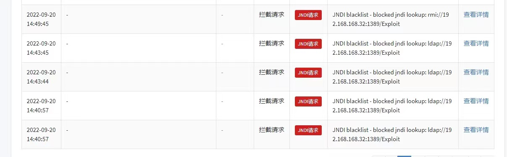
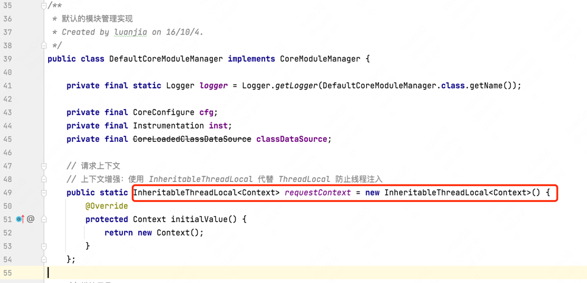
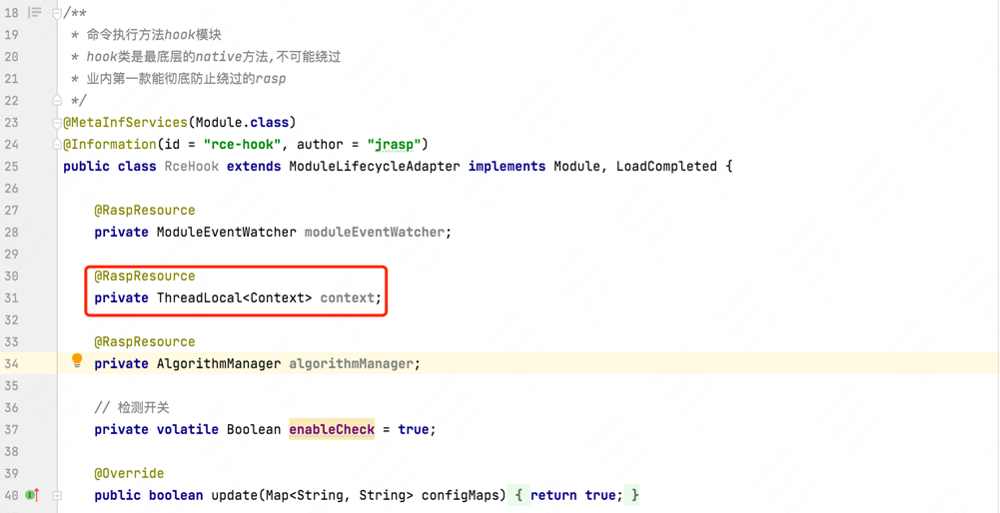
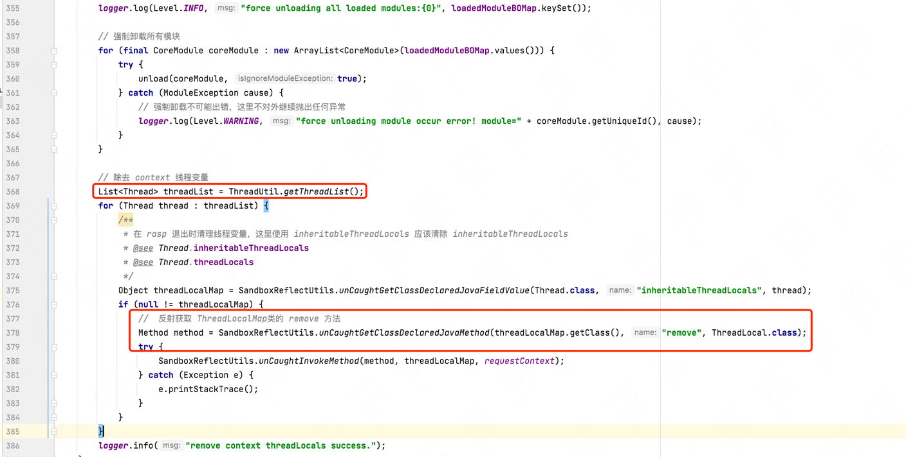
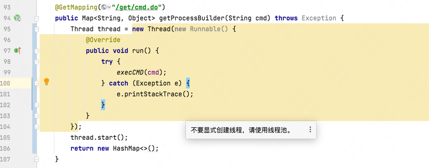
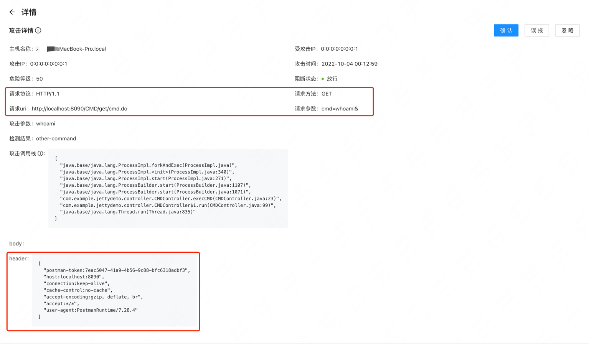
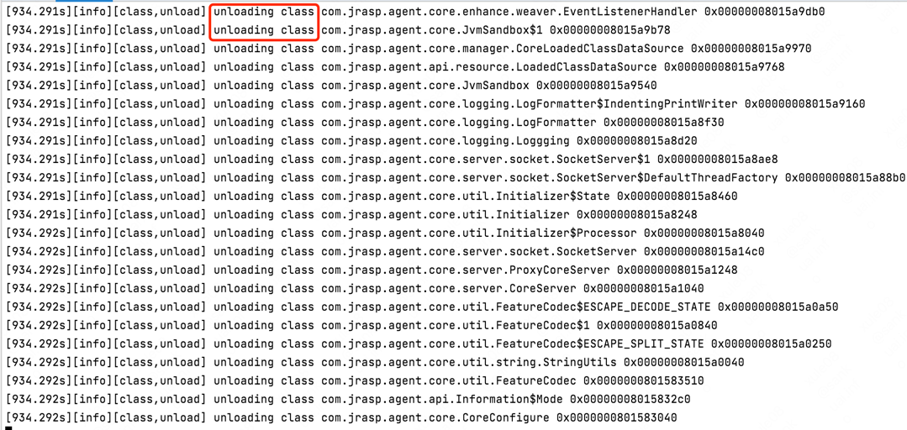

# 线程注入与JRASP实践

在任意代码执行漏洞中，攻击者通过开启一个新的线程来执行命令时，rasp丢失请求的上下文、执行堆栈等重要参数，导致检测算法（堆栈算法、ip黑名单、请求参数特征等无法关联）失效，极大的影响RASP的防御功能与溯源能力。

## 案例
如下案例：http 请求线程执行到下面的代码时，新建一个新的线程来执行任意，命令，http特征参数丢失。
```shell
<%@ page language="java" contentType="text/html; charset=UTF-8"
    pageEncoding="UTF-8"%>
    <%@ page import="java.io.IOException" %>
DOCTYPE html>
<html>
<head>
<meta charset="UTF-8">
<title>Insert title heretitle>
head>
<body>
<%
    // 创建线程执行命令，而不是直接执行命令
    Thread t = new Thread(new Runnable() {
            @Override         
            public void run() {             
              try {
                Runtime.getRuntime().exec(new String[]{"touch","/tmp/test"});             
              } catch (IOException e) {
                 e.printStackTrace();
              }
            }
    });
    t.start();
    out.println(">==test==<");
%>
body>
html>
```

RASP 最终截获的参数如下：http 参数丢失，无法溯源 （并非bug，应该是实现原理上的缺陷）。


## 参数丢失原因

open-rasp 中使用`ThreadLocal`在线程的不同hook点处传递http等参数，由于无法跨线程，参数必然丢失。

## 优化措施

有更好的线程关联类，来解决上面新建线程参数丢失问题：`java.lang.InheritableThreadLocal` 类

> Inheritable thread-local variables are used in preference to ordinary thread-local variables when the per-thread-attribute being maintained in the variable (e.g., User ID, Transaction ID) must be automatically transmitted to any child threads that are created.

实现原理：在父线程创建子线程时，向子线程传递变量。可以参考:[InheritableThreadLocal](https://www.jianshu.com/p/94ba4a918ff5)

## JRASP 实现

+ 使用`InheritableThreadLocal`创建线程变量



+ 注入到模块中




+ 线程变量的清除

> 线程变量在使用时完成之后，必须手动释放（释放时机难以掌控），否则会有内存泄漏问题.

由于jrasp的基本特征是热卸载（加载），如果不能清除线程变量，将会导致已经加载的 jrasp-agent/module 无法正常卸载，造成比较严重的内存OOM

因此，jrasp-agent 在卸载时, 执行强制清除线程变量操作，彻底解决内存泄漏问题（业内首创）；



## 效果演示

jsp比较难用，我这里用 springboot 演示：



检测结果：http 参数未丢失



卸载jrasp后，触发full gc 
```shell
./attach -p <pid> -s
```
可以看到jvm的类卸载事件：


## 新版本功能预览

### 1.1.0【2022-10】（当前开发版本）

#### Enhancement
+ [attach] 新增jrasp-attach工程(Golang)，支持手动注入、查看hook类、更新模块参数和卸载RASP
+ [agent] agent依赖的bridge打包时指定，防止加载错误依赖
+ [agent] 去掉logback/sl4j，使用原生jul ，减少不安全的依赖
+ [agent] 去掉内置jetty，使用原生socket
+ [agent] 使用InheritableThreadLocal代替ThreadLocal防止线程注入
+ [agent] 去掉java-agent的json日志格式，并修改filebeat的日志分割grok表达式
+ [module] 上下文对象优化为context对象
+ [module] module统一参数更新接口
+ [project] 将jrasp-agent、jrasp-module、jrasp-attach和jrasp-daemon等工程合并，统一编译打包
+ [project] 全面兼容 windows、linux、mac
#### BugFix
+ [agent] jar包文件名称增加版本号，解决jar包文件句柄清除问题
+ [module] 替换 @Resource 注解，解决与javax包类的冲突
+ [agent] 解决 jvm-sandbox 抛出异常时的内存泄漏 bug （jvm-sandbox 已经合入补丁）
+ [jetty module] 解决 http input.read方法重复hook问题 （在open—rasp上已经复现该bug）
+ [xxe module] 解决dom4j方法重复hook问题 （在open—rasp官方已经确认该问题）

#### TODO
+ [agent] 优化类匹配机制，全局唯一transform实例，减少stw时间

### 1.0.8 【2022-08】（内部测试版本）

#### Enhancement

+ [module] 增加多个安全模块
+ [daemon] 进程扫描优化
+ [daemon] 防止启动多个守护进程

### 1.0.7 【2022-07】（用户使用的稳定版本）

#### Enhancement

+ [daemon] 上报配置更新时间
+ [daemon] daemon启动上报nacos初始化的状态和注册的服务ip
+ [daemon] 发现无法连接nacos时，自动重启，24小时检测一次

#### BugFix

+ [daemon] 修复软刷新panic
+ [daemon] 删除获取依赖的功能，由安全插件自行上报


### 1.0.6 【2022-06】

#### BugFix

+ [daemon] 使用 os.RemoveAll 删除Java进程文件夹

### 1.0.5 【2022-06】

+ [daemon]插件以配置文件为准，配置文件中没有的，删除磁盘上的
+ [daemon]注入后增加软刷新功能和参数更新功能

### 1.0.4 【2022-05】 （开源版本）

+ [agent] 增加native方法hook
+ [daemon] 支持对多个Java进程注入，每个Java进程独立的数据目录
